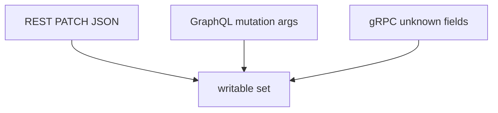

# Binder maps any key; the contract is the writable set

**Kind:** design-exercise
**Loop step:** 2 Model

## Could someone else name the checks from your map?

“We published OpenAPI” is not this lesson. A map someone else can test names **the action, the writable keys, and every protocol that binds a document**.

This week’s freeze: the notes app’s local `apply(user, body)` with `ALLOWED = {display_name}`. No live APIs.

## Picture: three binders, one contract

If REST is allow-listed and GraphQL `updateUser(input: JSON)` is not, the contract has a hole. Schema listing leaking extra arguments is how an attacker *finds* them. It is not the write itself.

## Picture: inventory of every protocol

A spec that does not match running code is leftover-endpoint awareness, not the allow-list. Versioning the path to `/v2` without retiring `/v0` is not a security control.

## Step 1: freeze the pieces

| Piece | This system |
|---|---|
| Who | Signed-in member; leftover `/v0` client |
| What | `display_name`, `is_admin` |
| Actions | `apply` / PATCH |
| Paths | JSON PATCH; later GraphQL and protobuf |
| What you trust | Server-side `ALLOWED` |
| What you do not trust | JSON keys; generated clients; GraphQL variables |
| Time | One PATCH; leftover undocumented route |
| Authorization cell | Authorization of properties |

## Step 2: write cells the practice can fail

| Who | What | Action | Decision |
|---|---|---|---|
| member | `display_name` | PATCH | allow |
| member | `is_admin` | PATCH | deny |
| member | unknown key | PATCH | ignore or reject |
| OpenAPI comment | any | document | not what you trust |
| leftover `/v0` | any | call | inventory then deny |

## Practice

Draw the matrix. Point at `labs/7.1/7.1-lab` file `patch.py`. Label the binder even in the repaired tree — the fix is the writable set, not pretending an OpenAPI file became the drop.

## Use it somewhere new

GraphQL `updatePatient(isStaff: true)`; protobuf field numbers not in the writable set.

## What can still go wrong

Honest `display_name` XSS (6.2). GraphQL cost (6.7). Unused methods (leftover, later, advanced). 7.2 field *reads*. 7.4 job payloads.

## What this page is not doing

Do not define security as a famous-bugs list. Answer keys are not on this site.
