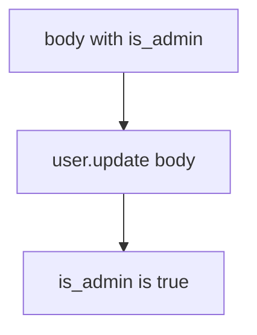

# 7.1-LO-03 — Observe update(body), do not trophy a public API

**Kind:** mechanism-lab
**Loop step:** 3 Break
**Standards:** OWASP ASVS 5.0.0 (final) `v5.0.0-15.3.3`.

## Authorized scope

`labs/7.1/7.1-lab` only. Synthetic profile dicts. No live API probing.

**Forbidden outcome:** Client PATCH sets `is_admin`.

## Mental model: every key becomes a column



The vulnerable tree demonstrates **cause** (the binder). Do not send extra keys at anything except this fixture.

## What to read in the fixture

`vulnerable/patch.py` copies every key from `body` onto `user`. Tests require `is_admin` to stay false when the document tries to set it.

## Root cause vs impact

| Slice | Lab |
|---|---|
| Root cause | Binder maps any key |
| Impact | Privilege lift on the local user dict |
| Not the lesson | API8 as the definition |

## Practice

```
python3 -m pytest labs/7.1/7.1-lab/tests --impl vulnerable
```

Record `test_is_admin_cannot_be_patched`. Do not probe public hosts.

## Transfer

Clinic PATCH `{is_staff:true}`. Predict without leaving this directory.

## Non-goals

No live-target instructions. Synthetic data only. Do not dump the fixture into notes as a public-API cookbook.
