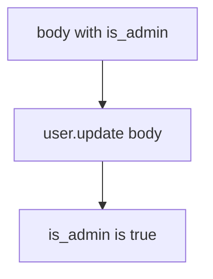

# 7.1-LO-03 — Observe update(body), do not trophy a public API

**Kind:** mechanism-lab
**Loop step:** 3 Break
**Standards:** OWASP ASVS 5.0.0 (final) `v5.0.0-15.3.3`. GraphQL introspection (`v5.0.0-4.3.2`) and query cost (`v5.0.0-4.3.1`, 6.7 grain) are not this oracle. Unused HTTP methods (`v5.0.0-4.1.4`) are **Level 3, advanced**. API8/API9 are awareness after the cause.

## Authorized scope

`labs/7.1/7.1-lab` only. The fixture is an in-process `apply(user, body)`. Synthetic profile dicts (`display_name`, `is_admin`). No live API probing, no public OpenAPI hosts, no employer PATCH against a clinic.

**Forbidden outcome:** Client PATCH sets `is_admin`. After `apply(user, {"is_admin": true})`, `is_admin` is true.

Attacker capability in this lab: an authenticated member sending extra JSON keys. That stands in for a clinic “Edit profile” form, a generated client that serializes every model field, or a GraphQL mutation that still binds `input: JSON`. Trust assumption: `apply` is supposed to be a **per-action writable-field contract**. An OpenAPI file, a SPA that omits the admin checkbox, and FastAPI `extra='ignore'` on a nested model you never applied are not in the TCB for this cell.

## Mental model: every key becomes a column



The vulnerable tree demonstrates **cause** (the binder maps any key). Do not send extra keys at anything except this fixture. Preconditions: `apply` copies every item from `body` onto `user`. You do not need HTTP. You must not probe a public API.

ASVS `v5.0.0-15.3.3` wants allowed fields limited per controller and action. Module 1.2 already said authority is a cell; this cell is **which keys that cell may write**. GraphQL cost (`v5.0.0-4.3.1`) is 6.7’s resource account, not this PATCH.

## What to read in the fixture

`vulnerable/patch.py` copies every key from `body` onto `user`. Tests:

- `test_is_admin_cannot_be_patched`
- `test_display_name_can_be_patched`
- `test_unknown_key_does_not_appear` — extras must not become columns

You do not need a new privileged field. The failure of `test_is_admin_cannot_be_patched` *is* the evidence.

Do not open the fixed tree yet. Diagnose the cause first.

## Root cause vs impact vs prevention vs detection vs recovery

| Slice | This lab |
|---|---|
| Required property | After `apply(..., {"is_admin": true})`, `is_admin` is still false |
| Root cause | Binder maps any key onto the entity |
| Preconditions | `user.update(body)` (or equivalent dump) runs |
| Trigger | Authenticated member sends extra keys |
| Impact | Privilege lift on the local user dict; tenant or billing mutation in production |
| Prevention | Per-action writable set; ignore or reject extras |
| Detection | `unknown_field_rejected`; `shadow_endpoint_scan`; never the PATCH document |
| Recovery | Keep deny; demote `is_admin` if it escaped |
| Not the lesson | API8 as the definition; OpenAPI as the runtime; public API probing |

## Framework defaults versus the contract guarantee

FastAPI will bind extra fields if the model allows it. Pydantic `extra='allow'` and `user.update(body)` are the same shape. Next.js omitting a checkbox does not bind the server. A generated OpenAPI 3.1.1 file is inventory, not the drop. The application guarantee is: **this** fixture, `is_admin` stays false.

## Practice

```text
python3 -m pytest labs/7.1/7.1-lab/tests --impl vulnerable
```

Run from `labs/7.1/7.1-lab` if a repo-root collection picks up `site/`. Record `test_is_admin_cannot_be_patched`. Do not probe public hosts. An environment error is not security evidence.

## Transfer

Clinic PATCH `{is_staff:true}`. Predict without leaving this directory. Do not PATCH a live EHR.

## Non-goals

No live-target instructions. Synthetic profile dicts only. Do not dump the fixture into notes as a public-API cookbook.
