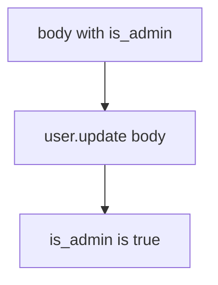

# Practice: user.update(body) sets is_admin

**Kind:** mechanism-lab
**Loop step:** 3 Break

## Try it

The practice is not a website you attack. It is a tiny Python `apply(user, body)`. The failure is already in the function: `user.update(body)` copies every key, so `is_admin` becomes true. You are here to see that extra keys writing `is_admin` is **a failed rule**, not a trophy against a public API.

The rule under test:

> After `apply(user, {"is_admin": true})`, `is_admin` must still be false. Extra keys are not writable fields.

## Where you may practice

Only `labs/7.1/7.1-lab` is in scope. The helper is an in-process `apply(user, body)`. Fake profile dicts (`display_name`, `is_admin`). It does not open a network. Do not probe a live API, a public OpenAPI host, or an employer clinic change.

Do not paste this exercise onto a public API, employer clinic, or live EHR.

What must not happen: **`user.update(body)` sets `is_admin`**. After `apply(user, {"is_admin": true})`, `is_admin` is true.

Attacker capability in this practice: a signed-in member sending extra JSON keys. That stands in for a clinic “Edit profile” form, a generated client that serializes every model field, or a GraphQL mutation that still binds `input: JSON`. What you trust: `apply` is supposed to be a **per-action writable-field contract**. An OpenAPI file, a SPA that omits the admin checkbox, and FastAPI ignoring extras on a nested model you never applied are not what you trust for this cell.

## Picture: every key becomes a column



The broken files show **cause** (the binder maps any key). Do not send extra keys at anything except these local files. What has to be true first: `apply` copies every item from `body` onto `user`. You do not need HTTP. You must not probe a public API.

Industry lists want allowed fields limited per action. Last topic (1.2) already said authority is a cell; this cell is **which keys that cell may write**. GraphQL query cost is 6.7’s resource account, not this PATCH.

## What to read in the broken files

`vulnerable/patch.py` copies every key from `body` onto `user` with `user.update(body)`. Checks:

- `test_is_admin_cannot_be_patched`
- `test_display_name_can_be_patched`
- `test_unknown_key_does_not_appear` — extras must not become columns

You do not need a new privileged field. The failure of `test_is_admin_cannot_be_patched` *is* the evidence.

Do not open the repaired files yet. Diagnose the cause first.

## Why it happens vs what it costs

| Slice | This practice |
|---|---|
| Required rule | After `apply(..., {"is_admin": true})`, `is_admin` is still false |
| Why it happens | Binder maps any key onto the row |
| What has to be true first | `user.update(body)` (or equivalent dump) runs |
| Trigger | A signed-in member sends extra keys |
| What it costs | Privilege lift on the local user dict; company or billing mutation in production |
| How you stop it | Per-action writable set; ignore or reject extras |
| How you notice | `unknown_field_rejected`; `shadow_endpoint_scan`; never the PATCH document |
| How you recover | Keep deny; demote `is_admin` if it escaped |
| Not the lesson | A bug-list sticker, OpenAPI as the runtime, or a public API probe |

## What the framework does vs what you still have to check

FastAPI will bind extra fields if the model allows it. Pydantic allowing extras and `user.update(body)` are the same shape. Next.js omitting a checkbox does not bind the server. A generated OpenAPI file is inventory, not the drop. The app’s promise is: **this** helper, `is_admin` stays false.

## Practice

```text
python3 -m pytest labs/7.1/7.1-lab/tests --impl vulnerable
```

Run from `labs/7.1/7.1-lab` if a repo-root collection picks up `site/`. Record `test_is_admin_cannot_be_patched`. Do not “fix” the check to pass. The failure *is* the evidence that the rule is currently false. Do not probe public hosts. An environment error is not security evidence.

## Use it somewhere new

Clinic PATCH `{is_staff:true}`. Predict without leaving this directory. Do not PATCH a live EHR.

## What this page is not doing

No live-target steps. Fake profile dicts only. Do not dump the helper into notes as a public-API cookbook.
