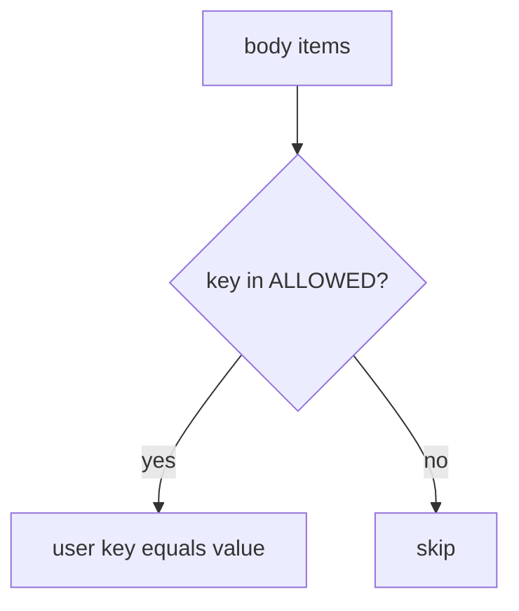

# 7.1-LO-04 — Copy only ALLOWED display_name

**Kind:** design-exercise
**Loop step:** 4 Build
**Standards:** OWASP ASVS 5.0.0 (final) `v5.0.0-15.3.3`. `v5.0.0-4.3.2` is GraphQL introspection (inventory). `v5.0.0-4.3.1` is 6.7 grain. `v5.0.0-4.1.4` unused methods is **Level 3, advanced**.

## Structural means the server copies named fields

`apply` must copy `display_name` when present and must not copy `is_admin`. Structural means that allow-list on the write — not an OpenAPI comment, not a frontend form that omits the checkbox, not a denylist of `is_admin` only.

The smallest restore for SecureCollab Phase 1 profile PATCH is: `ALLOWED = {"display_name"}`. Fail-safe: unknown keys are skipped (or rejected). Do not fail open because a nested model was `extra='allow'`.

## Mental model: extras never reach the row



The lab’s fixed tree copies only keys in `ALLOWED`. Production still needs the same matrix restated for GraphQL mutation arguments and gRPC unknown fields (LO-02). A denylist of `is_admin` only is not the contract — the next privileged field (`tenant_id`, billing flag) will slip through. Leftover `/v0` handlers are another binder of the same body.

ASVS `v5.0.0-15.3.3` wants that per-action limit implemented. This pytest is that sentence for `is_admin`.

## Why this restores the cell

| After the fix | Must be true |
|---|---|
| PATCH `is_admin` true | `is_admin` still false |
| PATCH `display_name` | name changes; `is_admin` unchanged |
| PATCH unknown key | key does not appear on the user |

## What this is not

OpenAPI as the runtime. GraphQL types without a resolver allow-list. gRPC “unknown fields ignored” assumed without a test. FastAPI `extra='ignore'` on a nested model you never applied. SPA omit-checkbox as the contract.

## Mechanism limits

- The allow-list must be restated for REST, GraphQL, and gRPC — one OpenAPI file does not cover the others.
- CSV import, admin BFF, and 7.4 job payloads are additional binders.
- Unused HTTP methods (`v5.0.0-4.1.4`, Level 3 advanced) can still hit a leftover handler.
- GraphQL query cost (`v5.0.0-4.3.1`) can exhaust budget even when extras are dropped (6.7).
- Honest `display_name` XSS remains 6.2.

## Practice

Name the predicate (`key in ALLOWED`). Run:

```text
python3 -m pytest labs/7.1/7.1-lab/tests --impl fixed
```

Must pass. Run from the lab directory if collection at repo root is polluted.

## Transfer

Clinic: stop treating “the form has no is_staff checkbox” as the server contract.

## Residual risk

CSV import; 7.4 job payload; leftover `/v0`; `v5.0.0-4.1.4` Level 3 unused methods; GraphQL cost (`v5.0.0-4.3.1`); 6.2 on honest names.

## Non-goals

Do not probe a public API. Do not claim Gate 7 from an OpenAPI screenshot.
