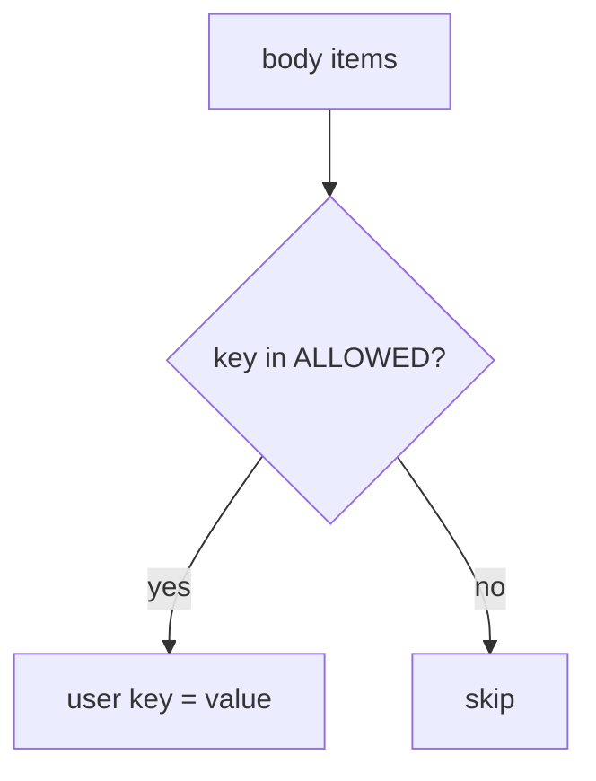

# 7.1-LO-04 — Copy only ALLOWED display_name

**Kind:** design-exercise
**Loop step:** 4 Build
**Standards:** OWASP ASVS 5.0.0 (final) `v5.0.0-15.3.3`.

## Structural means the server copies named fields

`apply` must copy `display_name` when present and must not copy `is_admin`. Structural means that allow-list on the write — not an OpenAPI comment, not a frontend form that omits the checkbox.

## Mental model: extras never reach the row



Fail-safe: unknown keys are skipped (or rejected). A denylist of `is_admin` only is not the contract — the next privileged field will slip through.

## Why this restores the cell

| After the fix | Must be true |
|---|---|
| PATCH `is_admin` true | `is_admin` still false |
| PATCH `display_name` | name changes; `is_admin` unchanged |
| PATCH unknown key | key does not appear on the user |

## What this is not

OpenAPI as the runtime. GraphQL types without a resolver allow-list. gRPC “unknown fields ignored” assumed without a test. FastAPI `extra='ignore'` on a nested model you never applied.

## Practice

Name the predicate. Run:

```
python3 -m pytest labs/7.1/7.1-lab/tests --impl fixed
```

Must pass.

## Transfer

Clinic: stop treating “the form has no is_staff checkbox” as the server contract.

## Residual risk

CSV import; 7.4 job payload; leftover `/v0`; `v5.0.0-4.1.4` Level 3 unused methods; GraphQL cost (`v5.0.0-4.3.1`).
