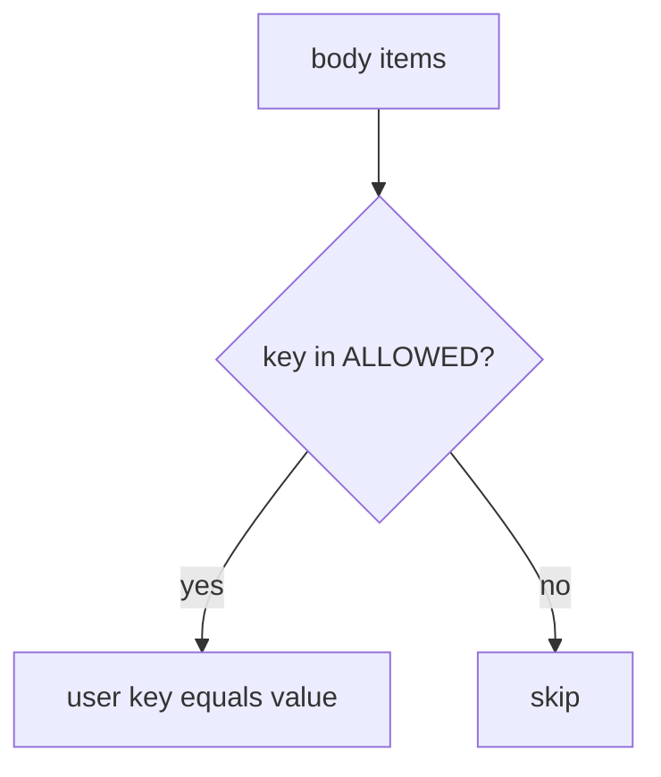

# Copy only the allowed display name

**Kind:** design-exercise
**Loop step:** 4 Build

## The rule

An OpenAPI comment does not stop `is_admin` in the body. A frontend form that omits the checkbox is the client. A denylist of `is_admin` only still lets unknown keys through.

The restore: the server **copies named fields**. `apply` must copy `display_name` when present and must not copy `is_admin`. Copy only the allowed display name.

Restore the notes app’s profile PATCH with this: `ALLOWED = {"display_name"}`. Fail-safe: unknown keys are skipped (or rejected). Do not allow just because a nested model was allowed to keep extras.

## Picture: extras never reach the row



`apply` copies only keys in `ALLOWED`. Restate that matrix for GraphQL mutation arguments and gRPC unknown fields (the map page). A denylist of `is_admin` only is not the contract — the next privileged field (`tenant_id`, billing flag) will slip through. Leftover `/v0` handlers are another binder of the same body.

That per-action limit has to be implemented — `is_admin`.

## What the repaired files must show

| After the fix | Must be true |
|---|---|
| PATCH `is_admin` true | `is_admin` still false |
| PATCH `display_name` | name changes; `is_admin` unchanged |
| PATCH unknown key | key does not appear on the user |

If the key is not in `ALLOWED`, **do not copy it**. Do not keep `user.update(body)` because “the spec does not list `is_admin`.”

## What this is not

- OpenAPI as the runtime.
- GraphQL types without a resolver allow-list.
- gRPC “unknown fields ignored” assumed without a test.
- FastAPI ignoring extras on a nested model you never applied.
- SPA omit-checkbox as the contract.

## What the tool cannot do

- The allow-list must be restated for REST, GraphQL, and gRPC — one OpenAPI file does not cover the others.
- CSV import, admin BFF, and 7.4 job payloads are additional binders.
- Unused HTTP methods can still hit a leftover handler (leftover, later, advanced).
- GraphQL query cost can exhaust budget even when extras are dropped (6.7).
- Honest `display_name` XSS remains 6.2.

## Practice

Name the predicate (`key in ALLOWED`). Run:

```text
python3 -m pytest labs/7.1/7.1-lab/tests --impl fixed
```

## Use it somewhere new

Stop treating “the form has no is_staff checkbox” as the server contract.

## What can still go wrong

CSV import; 7.4 job payload; leftover `/v0`; unused methods (leftover, later, advanced); GraphQL cost (6.7); 6.2 on honest names.

## What this page is not doing

Do not probe a public API. Do not claim Gate 7 from an OpenAPI screenshot.
