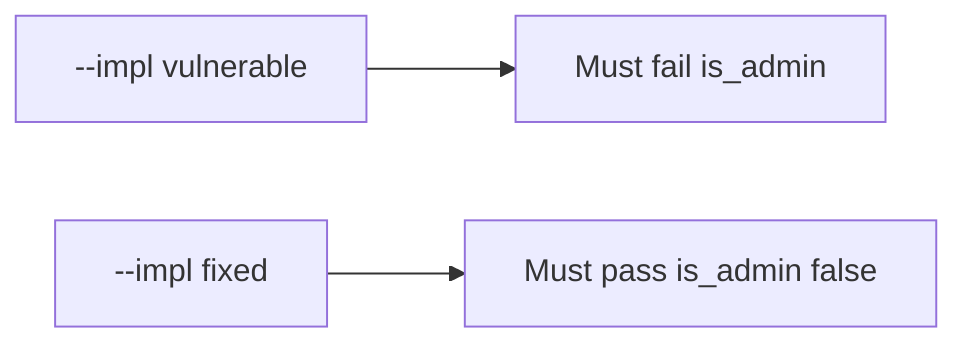

# Honest rename vs is_admin vs unknown keys

**Kind:** verification-lab
**Loop step:** 5 Verify

## Until you can fail it, it is still a slogan

“We have OpenAPI” is not evidence. “The SPA has no admin checkbox” is a tool observation. The check is three observations, not one: an honest rename may change `display_name`; after `apply(user, {"is_admin": true})`, `is_admin` is false; unknown keys do not become columns. The `is_admin` observation must be **false** on `--impl vulnerable` (`user.update(body)` writes true) and **true** on `--impl fixed`. Do not probe public APIs.

## Picture: broken files must fail: is_admin

A check that only counts passing cases can still look green while extra keys still write `is_admin`. The broken files have to fail that case. The repaired files have to pass it.



If both pass, the check is not looking at extra keys. If both fail, the fix is not structural or the check is wrong.

## Three things to look at

| Mode | Must show for this topic |
|---|---|
| Normal | Honest `display_name` may change (`test_display_name_can_be_patched`; may pass on both) |
| Wrong input / abuse | `is_admin` stays false; broken files must fail (`test_is_admin_cannot_be_patched`) |
| Extra | Unknown keys do not become columns (`test_unknown_key_does_not_appear`) |
| Not claimed | GraphQL cost; unused methods; production inventory matches OpenAPI |

The checks live in `labs/7.1/7.1-lab/tests/test_property.py`. `test_is_admin_cannot_be_patched` exists so a binder that writes `is_admin` cannot count as a pass.

```text
python3 -m pytest labs/7.1/7.1-lab/tests --impl vulnerable
python3 -m pytest labs/7.1/7.1-lab/tests --impl fixed
```

Honest `display_name` may pass on both implementations. That does not excuse the `is_admin` deny check. If the broken files do not fail `test_is_admin_cannot_be_patched`, the practice is miswired — fix the wiring, not the check.

## What the checks do not prove

- GraphQL schema listing off in production
- Query cost (6.7)
- Unused HTTP methods (leftover, later, advanced)
- That OpenAPI matches every running handler
- Field *reads* of privileged columns (7.2)
- Job-payload binders (7.4)

Write those down as leftover risk or later topics, not as silent passes.

## Practice

Run both implementations this session from the lab directory if needed. Write the fail/pass pair next to the notes for this topic. Reject a “check” that only greps `extra = 'forbid'` in a Pydantic model without calling `apply(..., {"is_admin": true})`. A setup error is not proof the rule holds.

## Use it somewhere new

Clinic PATCH `{is_staff:true}`. A check that only asserts HTTP 200 on `/patients/{id}` is not this rule (see 9.3). A public API probe is out of scope.

## What this page is not doing

Do not treat a live OpenAPI screenshot as proof. Do not log PATCH bodies. Answer keys are not on this site.
