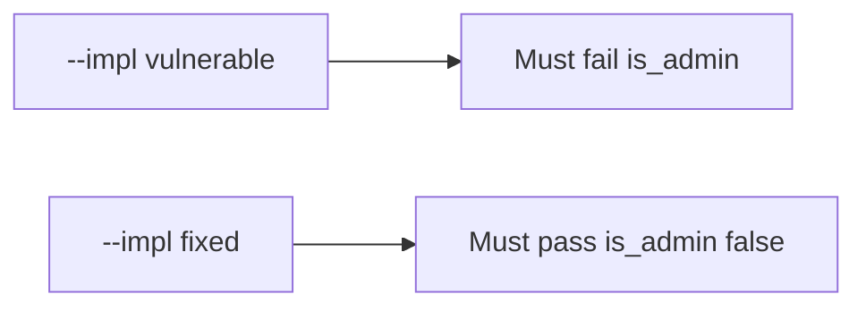

# 7.1-LO-05 — Evidence is is_admin unchanged, then a passing pair

**Kind:** verification-lab
**Loop step:** 5 Verify
**Standards:** OWASP ASVS 5.0.0 (final) `v5.0.0-15.3.3`.

## An invariant that cannot fail a test is still a slogan

“We have OpenAPI” is not evidence. “The SPA has no admin checkbox” is a mechanism observation. The oracle is: after `apply(user, {"is_admin": true})`, `is_admin` is false, and honest `display_name` may change. The `is_admin` observation must be **false** on `--impl vulnerable` (binder writes true) and **true** on `--impl fixed`. Do not probe public APIs.

## Mental model: vulnerable must fail: is_admin

The failing observation on `--impl vulnerable` is **is_admin**. A passing collection count is not this cell.



| Mode | Must show for this module |
|---|---|
| Negative / abuse | `is_admin` stays false; vulnerable must fail |
| Normal | `display_name` may change (may pass on both) |
| Extra | unknown keys do not become columns |
| Not claimed | GraphQL cost; unused methods; production inventory matches OpenAPI |

Lab tests in `labs/7.1/7.1-lab/tests/test_property.py`. `test_is_admin_cannot_be_patched` is a **forbidden-outcome** test: a binder that writes `is_admin` is not allowed to count as a passing control.

```text
python3 -m pytest labs/7.1/7.1-lab/tests --impl vulnerable
python3 -m pytest labs/7.1/7.1-lab/tests --impl fixed
```

Honest `display_name` may pass on both implementations. That does not excuse the `is_admin` deny test. If vulnerable does not fail `test_is_admin_cannot_be_patched`, the lab is miswired—fix the wiring, not the assertion.

## What the tests do not prove

- GraphQL introspection off (`v5.0.0-4.3.2`)
- Query cost (`v5.0.0-4.3.1` / 6.7)
- Unused HTTP methods (`v5.0.0-4.1.4`, Level 3 advanced)
- That OpenAPI matches every running handler
- Field *reads* of privileged columns (7.2)
- Job-payload binders (7.4)

Record those as residuals or later modules, not as silent passes.

## Practice

Execute both implementations this session from the lab directory if needed. Write the fail/pass pair next to the matrix row. Reject a “test” that only greps `extra = 'forbid'` in a Pydantic model without calling `apply(..., {"is_admin": true})`.

## Transfer

Clinic PATCH `{is_staff:true}`. A test that only asserts HTTP 200 on `/patients/{id}` is not this cell (see 9.3). A public API probe is out of scope.

## Non-goals

Do not add a live OpenAPI trophy. Do not log PATCH bodies. Keys stay out of this file.
