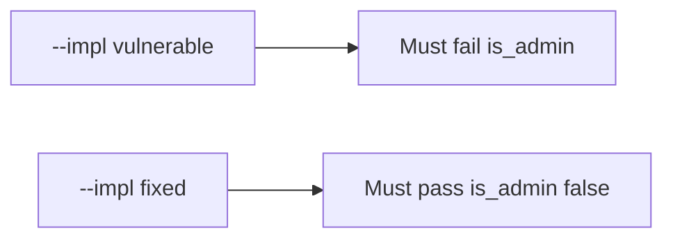

# 7.1-LO-05 — Evidence is is_admin unchanged, then a passing pair

**Kind:** verification-lab
**Loop step:** 5 Verify
**Standards:** OWASP ASVS 5.0.0 (final) `v5.0.0-15.3.3`.

## An invariant that cannot fail a test is still a slogan

“We have OpenAPI” is not evidence. The oracle is the local pair. Do not probe public APIs.

## Mental model: vulnerable must fail: is_admin

The failing observation on `--impl vulnerable` is **is_admin**. A passing collection count is not this cell.



| Case | Must show |
|---|---|
| Negative / abuse | `is_admin` stays false |
| Normal | `display_name` may change |
| Extra | unknown keys do not become columns |
| Not claimed | GraphQL cost; unused methods; production inventory |

```
python3 -m pytest labs/7.1/7.1-lab/tests --impl vulnerable
python3 -m pytest labs/7.1/7.1-lab/tests --impl fixed
```

Honest `display_name` may pass on both.

## What the tests do not prove

- GraphQL introspection off (`v5.0.0-4.3.2`)
- Query cost (`v5.0.0-4.3.1` / 6.7)
- Unused HTTP methods (`v5.0.0-4.1.4`, Level 3)
- That OpenAPI matches every running handler

## Practice

Execute both implementations. Map each test to an LO-02 cell.

## Transfer

Clinic: a test that only asserts HTTP 200 on `/patients/{id}` is not this cell.
