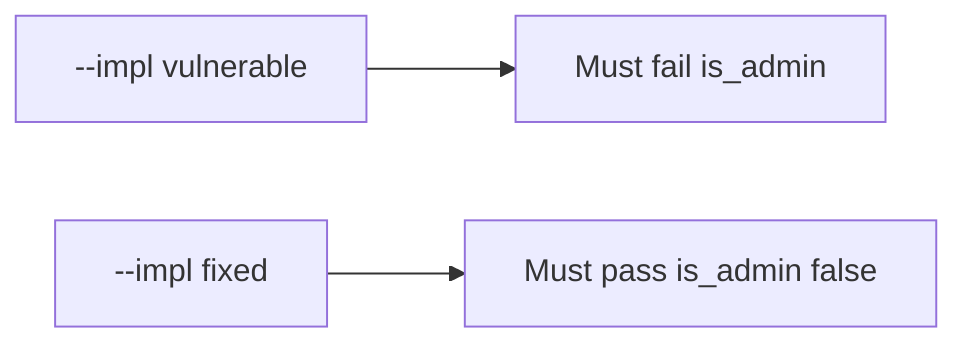

# Honest rename vs is_admin vs unknown keys

**Kind:** verification-lab
**Loop step:** 5 Verify

## Check it

An OpenAPI file does not stop `is_admin` in the body. A SPA that hides the checkbox is the client. Three observations: an honest rename may change `display_name`; after `apply(user, {"is_admin": true})`, `is_admin` stays false; unknown keys do not become columns. Leftover: `user.update(body)` still writes `is_admin`. Repair leaves that key false. Do not probe public APIs.

## Picture: broken files must fail: is_admin

Extra keys can still write `is_admin` even when other tests pass.



If the broken PATCH still passes, extra keys were never rejected.

## Three things to look at

| Mode | Must show for this topic |
|---|---|
| Normal | Honest `display_name` may change (`test_display_name_can_be_patched`; may pass on both) |
| Wrong input / abuse | `is_admin` stays false; broken files must fail (`test_is_admin_cannot_be_patched`) |
| Extra | Unknown keys do not become columns (`test_unknown_key_does_not_appear`) |
| Not claimed | GraphQL cost; unused methods; production inventory matches OpenAPI |

The checks are in `labs/7.1/7.1-lab/tests/test_property.py`. `test_is_admin_cannot_be_patched` is there so a binder that writes `is_admin` still fails.

```text
python3 -m pytest labs/7.1/7.1-lab/tests --impl vulnerable
python3 -m pytest labs/7.1/7.1-lab/tests --impl fixed
```

Do not let patching `display_name` hide the leftover. Drop `is_admin` from the body. If the broken files do not fail `test_is_admin_cannot_be_patched`, the practice is miswired — fix the wiring, not the check.

## What the checks do not prove

- GraphQL schema listing off in production
- Query cost (6.7)
- Unused HTTP methods (leftover, later, advanced)
- That OpenAPI matches every running handler
- Field *reads* of privileged columns (7.2)
- Job-payload binders (7.4)

## Practice

Call `apply(..., {"is_admin": true})`. `extra = 'forbid'` on a Pydantic model is the schema file. A setup error is not proof the rule holds.

## Use it somewhere new

A 200 from `/patients/{id}` after PATCH `{is_staff:true}` does not prove `is_admin` stayed false (see 9.3). Do not use a public API probe.

## What this page is not doing

A live OpenAPI screenshot is not `is_admin` staying false. Do not log PATCH bodies. Answer keys are not on this site.
