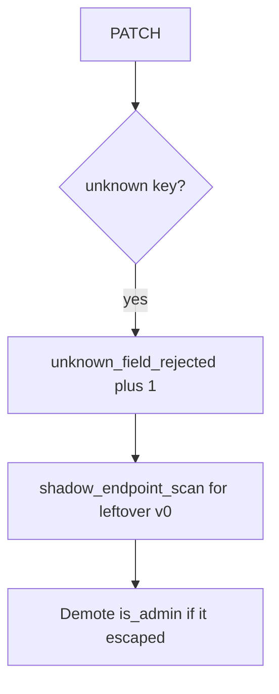

# Extra-key denials without logging the document

**Kind:** operations-exercise
**Loop step:** 6 Operate

## Fixing it once is not enough

A GraphQL mutation or leftover `/v0` PATCH can skip the REST allow-list. The PATCH body and the profile JSON do not go in the ticket.

## Picture: extra keys are a signal



A checklist name does not copy `ALLOWED`.

## Signals that do not become a second leak

| Outcome | This topic |
|---|---|
| Notice | `unknown_field_rejected`; `shadow_endpoint_scan` |
| What the line holds | request id, subject id, field *name*; never the document |
| Recover | Keep deny; demote privilege flags; retire ghost routes |
| Leftover | GraphQL/gRPC binders; unused methods (later, advanced); 7.4 job payloads |

An API gateway sticker does not drop `is_admin`. `is_admin` in the PATCH body still has to fail `test_is_admin_cannot_be_patched`. Publishing OpenAPI does not filter PATCH. GraphQL `input: JSON` and leftover `/v0` still copy extra keys; the profile write is not honest until those binders are named.

## What the framework does vs what you still have to check

A web filter will show 400s on a schema mismatch and stay silent when `/v0/users` still runs `user.update(body)`. Notice must observe **`is_admin` still false**, not HTTP status counts. If the alert includes the PATCH JSON, you have opened a logging leak (3.1 / 5.1).

Extra-key denials fire without the document.

## Practice

```text
log_denied reason=unknown_field_rejected field=is_admin subject=user_71e request_id=req_71e
```

PATCH denials should log the unknown key — not the JSON, a real email, or a live trace against a public API.

## Use it somewhere new

Notice `is_staff` extras; do not attach the patient document to the ticket. Do not probe a live EHR.

## Can people still use it

If a human sees a field deny, announce “field not writable.” A silent 200 that also dropped `display_name` looks like a hang to assistive tech.

## What this page is not doing

An OpenAPI file does not finish this page. Do not follow public API probes. Opening this page does not finish a check-in.
