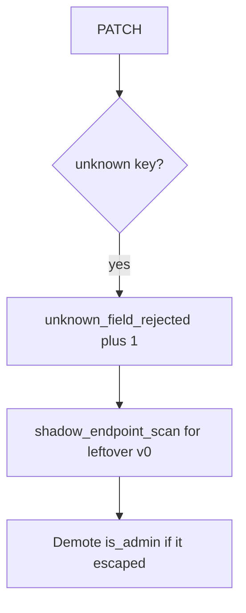

# Extra-key denials without logging the document

**Kind:** operations-exercise
**Loop step:** 6 Operate

## Stopping it is not enough

A new GraphQL mutation or leftover `/v0` PATCH can skip the REST allow-list after `apply` was “fixed once.” Pair notice and recover. Do not log the PATCH body (3.1 / 5.1). Do not attach the profile JSON to the ticket.

## Picture: extra keys are a signal



Industry lists name detect, respond, recover. They do not copy `ALLOWED`. They do not prove a checklist. Someone still has to own the leftover.

## Signals that do not become a second leak

| Outcome | This topic |
|---|---|
| Notice | `unknown_field_rejected`; `shadow_endpoint_scan` |
| What the line holds | request id, subject id, field *name*; never the document |
| Recover | Keep deny; demote privilege flags; retire ghost routes |
| Leftover | GraphQL/gRPC binders; unused methods (later, advanced); 7.4 job payloads |

An API gateway product name is not the rule. Re-run `test_is_admin_cannot_be_patched` after any profile-write change; a green “OpenAPI published” tile is not that pytest. GraphQL `input: JSON` and leftover `/v0` are other binders of the same body — list them before you claim Recover.

## What the framework does vs what you still have to check

A web filter will show 400s on a schema mismatch and stay silent when `/v0/users` still runs `user.update(body)`. Notice must observe **`is_admin` still false**, not HTTP status counts. If the alert includes the PATCH JSON, you have opened a logging leak (3.1 / 5.1).

The app’s promise is: **this** practice, extra-key denials fire without the document, and a gateway product name is not this week’s rule.

## Practice

Write one log line you would accept in review. Tie it to `labs/7.1/7.1-lab`. Example shape (fake ids only):

```text
log_denied reason=unknown_field_rejected field=is_admin subject=user_71e request_id=req_71e
```

Reject any line that includes the PATCH JSON, a real email, or a live trace against a public API.

## Use it somewhere new

Clinic: notice `is_staff` extras; do not attach the patient document to the ticket. Do not probe a live EHR.

## Can people still use it

If a human sees a field deny, announce “field not writable.” A silent 200 that also dropped `display_name` looks like a hang to assistive tech.

## What this page is not doing

An API gateway product name is not the rule. Public API probes are out of scope. Gates 0–10 stay not-attempted.
