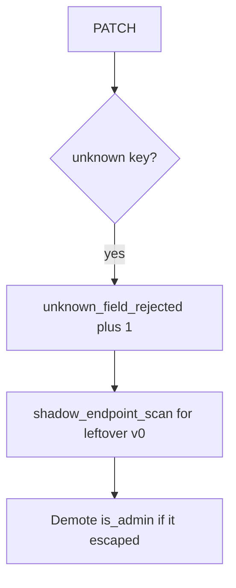

# 7.1-LO-06 — Detect unknown_field_rejected without the document

**Kind:** operations-exercise
**Loop step:** 6 Operate
**Standards:** NIST CSF 2.0 (final) DE/RS/RC as outcome labels; OWASP ASVS 5.0.0 (final) `v5.0.0-15.3.3`. CSF names outcomes; it does not copy `ALLOWED`.

## Prevention is not absolute

A new GraphQL mutation or leftover `/v0` PATCH can skip the REST allow-list after `apply` was “fixed once.” Pair detect and recover. Do not log the PATCH body (3.1 / 5.1). Do not attach the profile JSON to the ticket.

## Mental model: extra keys are a signal



| Outcome | This module |
|---|---|
| Detect | `unknown_field_rejected`; `shadow_endpoint_scan` |
| Signal | request id, subject id, field *name*; never the document |
| Recover | Keep deny; demote privilege flags; retire ghost routes |
| Residual | GraphQL/gRPC binders; unused methods Level 3; 7.4 job payloads |

CSF 2.0 Detect / Respond / Recover name outcomes. They do not prove `v5.0.0-15.3.3`. An API gateway product name is not the property. Re-run `test_is_admin_cannot_be_patched` after any profile-write change; a green “OpenAPI published” tile is not that pytest. GraphQL `input: JSON` and leftover `/v0` are other binders of the same body — inventory them before claiming Recover.

## Framework defaults versus the operate guarantee

A WAF will show 400s on a schema mismatch and stay silent when `/v0/users` still runs `user.update(body)`. Detection must observe **`is_admin` still false**, not HTTP status counts. If the alert includes the PATCH JSON, you have opened a 3.1 / 5.1 cell.

## Practice

Write one log line you would accept. Tie it to `labs/7.1/7.1-lab`.

```text
log_denied reason=unknown_field_rejected field=is_admin subject=user_71e request_id=req_71e
```

Reject any line that includes the PATCH JSON, a real email, or a live trace against a public API.

## Transfer

Clinic: detect `is_staff` extras; do not attach the patient document to the ticket. Do not probe a live EHR.

## Usability

If a human sees a field deny, announce “field not writable” (WCAG 2.2 Success Criterion 4.1.3). A silent 200 that also dropped `display_name` looks like a hang to assistive tech.

## Non-goals

An API gateway product name is not the property. Public API probes are out of scope. Gates 0–10 stay not-attempted.
