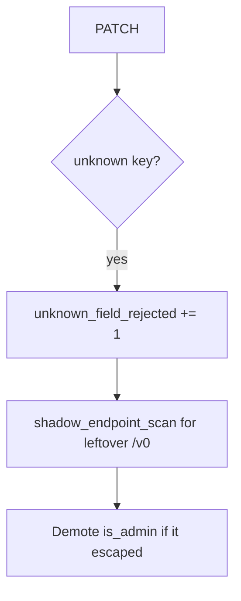

# 7.1-LO-06 — Detect unknown_field_rejected without the document

**Kind:** operations-exercise
**Loop step:** 6 Operate
**Standards:** NIST CSF 2.0 (final) DE/RS/RC as outcome labels; OWASP ASVS 5.0.0 (final) `v5.0.0-15.3.3`.

## Prevention is not absolute

A new GraphQL mutation can skip the REST allow-list. Pair detect and recover. Do not log the PATCH body (3.1).

## Mental model: extra keys are a signal



| Outcome | This module |
|---|---|
| Detect | `unknown_field_rejected`; `shadow_endpoint_scan` |
| Signal | request id, subject id, field *name*; never the document |
| Recover | Keep deny; demote privilege flags; retire ghost routes |
| Residual | GraphQL/gRPC binders; unused methods Level 3 |

## Practice

Write one log line you would accept. Tie it to `labs/7.1/7.1-lab`.

```
log_denied reason=unknown_field_rejected field=is_admin subject=user_71e request_id=req_71e
```

Reject any line that includes the PATCH JSON, a real email, or a live trace against a public API.

## Transfer

Clinic: detect `is_staff` extras; do not attach the patient document to the ticket.

## Non-goals

An API gateway product name is not the property.
