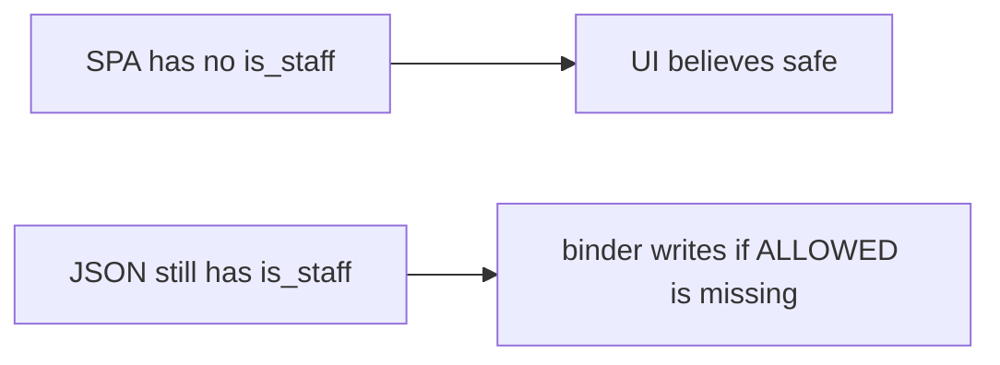

# 7.1-LO-07 — Transfer: clinic PATCH is_staff

**Kind:** transfer-challenge
**Loop step:** 7 Transfer
**Standards:** OWASP ASVS 5.0.0 (final) `v5.0.0-15.3.3`. API8/API9 awareness after. WCAG 2.2 for the deny message.

## Change the workplace; keep a writable-field contract

Do not answer with a Top 10 / CWE / scanner as the definition of security.

**Prompt:** Clinic PATCH patient `{is_staff:true}`. Also name GraphQL mutation arguments and gRPC unknown fields.

**Product sketch:** EHR-lite “Edit profile” form with no staff checkbox in the SPA, plus a generated OpenAPI file.

Rewrite the SecureCollab sentence. Include:

1. attacker capabilities (authenticated clinician session sending extra JSON — not a live clinic);
2. trust assumptions (server `ALLOWED` is TCB; SPA omit-checkbox and OpenAPI are not);
3. forbidden outcome (`is_staff` becomes true, not “HIPAA”);
4. a test idea on a **local** fixture only (no public API);
5. residual (GraphQL/gRPC binders, leftover `/v0`, Level 3 unused methods, 6.2 on honest names);
6. WCAG if a human deny path is in the claim (readable “field not writable,” not a silent 200 that dropped the name too).

## Mental model: missing checkbox is not the contract

## What graders reject

| Reject | Why |
|---|---|
| “OpenAPI is complete” | Inventory, not allow-list |
| Live clinic / public API | Lab policy |
| “GraphQL is typed” | Extra args and JSON scalars still bind |

## Practice

One page. No keys. `labs/7.1/7.1-lab` is the only running system you may break.
