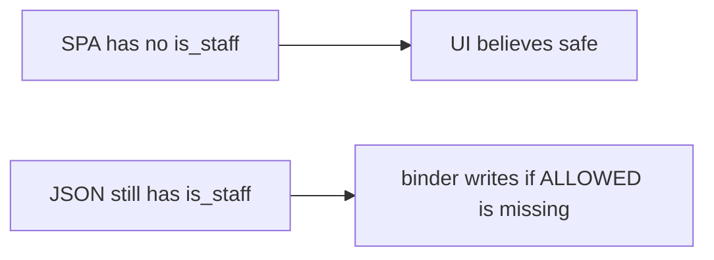

# Same idea on clinic PATCH is_staff

**Kind:** transfer-challenge
**Loop step:** 7 Transfer

## Use it somewhere new

You get a clinic PATCH patient `{is_staff:true}`. Also name GraphQL mutation arguments and gRPC unknown fields.

After `apply(user, {"is_admin": true})`, `is_admin` must still be false.

An EHR-lite “Edit profile” form with no staff checkbox in the SPA, plus a generated OpenAPI file.

## Picture: missing checkbox is not the contract

Here, `is_staff` is still `is_admin` for this rule. If “Edit profile” omits the staff checkbox while the server `apply` copies every key, the rule is gone. FastAPI, a generated OpenAPI file, and GraphQL “typed schema” do not copy `ALLOWED`. GraphQL mutation arguments and protobuf field numbers not in the writable set are the same binder family — name them, do not run those systems here. Honest `display_name` XSS is a 6.2 leftover even when extras are dropped.

| Notes app | Clinic sketch |
|---|---|
| Signed-in member sending extra JSON | Authenticated clinician session sending extra JSON — not a live clinic |
| `apply(user, {"is_admin": true})` | Clinic PATCH `{is_staff:true}` |
| Server `ALLOWED` is what you trust | Same; SPA omit-checkbox and OpenAPI are not |
| GraphQL / gRPC leftover | Mutation arguments and unknown fields — name them, do not run them here |

## Write this for a clinic PATCH is_staff

1. who can act (authenticated clinician session sending extra JSON — not a live clinic);
2. what you trust (server `ALLOWED` is what you trust; SPA omit-checkbox and OpenAPI are not);
3. what must not happen (`is_staff` becomes true, not “HIPAA”);
4. a check idea on **local** practice files only (no public API);
5. leftover risk (GraphQL/gRPC binders, leftover `/v0`, unused methods later and advanced, 6.2 on honest names);
6. the web accessibility baseline if a human deny path is in the claim (readable “field not writable,” not a silent 200 that dropped the name too).

`is_staff` still has to be false after an extra-key PATCH. `display_name` may still change. Documenting the PATCH in OpenAPI without an `is_staff` deny check leaves the binder open. The local check is `test_is_admin_cannot_be_patched` — on the practice files, not a live EHR PATCH.

## What is not good enough

| Reject | Why |
|---|---|
| “OpenAPI is complete” | Inventory, not allow-list |
| Live clinic / public API | Course rules |
| “GraphQL is typed” | Extra args and JSON scalars still bind |
| SPA omits checkbox as the contract | Client is not what you trust |
| HTTP 200 as extra-key evidence | Wrong observation |

## Practice

Write one page. Leave the keys closed. `labs/7.1/7.1-lab` is the only running system you may break. Do not probe a public host.

## What this page is not doing

Do not try live-target API attacks. Do not use real staff flags. This page does not finish a check-in.
