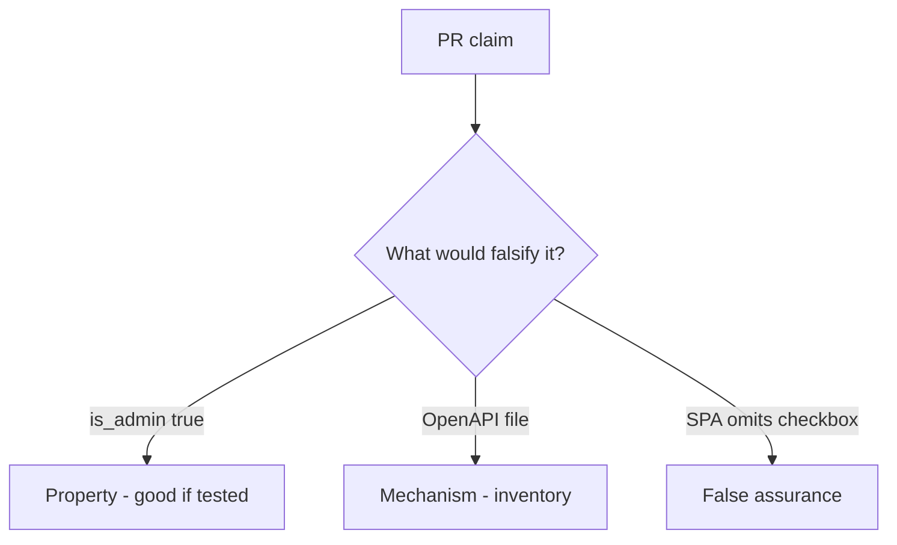

# 7.1-LO-08 — Review update(body) as a PR, not an API9 ticket

**Kind:** code-review
**Loop step:** Review
**Standards:** OWASP ASVS 5.0.0 (final) `v5.0.0-15.3.3`.

## Review the fixture as if it were SecureCollab profile PATCH

Review `labs/7.1/7.1-lab/vulnerable/` as a SecureCollab PR. Your job is not to count suspicious lines. Reconstruct whether `apply(..., {"is_admin": true})` still writes true, compare that with the module invariant, and write changes a developer can verify.

Intended findings live only in `content/assessment/keys/7.1.md` — not here. Do not open the keys file until your review has been evaluated.

## Mental model: user.update(body) / __dict__.update

Start with this seeded smell: **`user.update(body)` / `__dict__.update`**. Label it property, mechanism, or false assurance before you accept the PR.

Classification starts at the protected effect (`is_admin` still false). Everything that is not a server `ALLOWED` copy at that call is a candidate extra-key path. An OpenAPI file without that pytest is the same smell, not a different finding class.

A missing SPA checkbox (3.4’s client residual, restated for fields) does not bind `apply`. Leftover `/v0` and GraphQL `input: JSON` are other binders — name them, do not skip `test_is_admin_cannot_be_patched`.

## Seeded smells (label them yourself)

- `user.update(body)` / `__dict__.update`
- Undocumented route not in inventory
- No `is_admin` deny test
- OpenAPI not generated from the running handlers

Also reject: public API attacks; closing findings without re-running `test_is_admin_cannot_be_patched`; keys in lessons; dumping Pydantic models as the lesson.

## Misconceptions this module refuses

- If it is not in Swagger it cannot be called
- GraphQL is self-documenting therefore extra mutation args are safe
- Versioning is a security control
- A complete OpenAPI file proves extra keys are ignored
- API9 is the property

## Practice

Write three review notes a maintainer could act on. Each note: observation, property or false assurance, suggested structural change, residual you will **not** delete. Tie at least one to `test_is_admin_cannot_be_patched`.

## Transfer

Clinic PR that “documented the PATCH in OpenAPI” without an `is_staff` deny test is an incomplete mediation review. Name the independent falsehood that would still keep `is_staff` false.

## Non-goals

Do not merge by adding a comment “will allow-list later.” That comment is a residual without an owner. Do not probe a public API to prove the finding.
