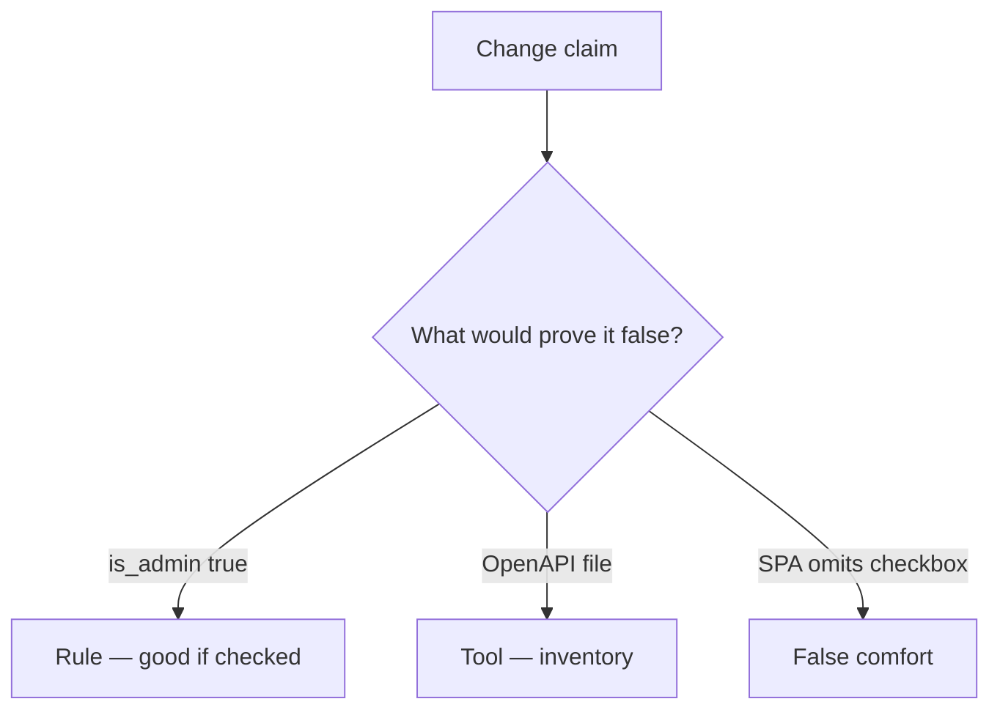

# Would you merge this update(body)?

**Kind:** code-review
**Loop step:** Review

Intended findings live only in the answer-key folder — not here. Do not open that file until your review has been evaluated.

## What you are reviewing

A colleague ships the notes app’s profile PATCH. Review `labs/7.1/7.1-lab/vulnerable/` as that change. Your job is not to count suspicious lines. Reconstruct whether `apply(..., {"is_admin": true})` still writes true, compare that with the rule, and write changes a developer can verify.

The check you already ran (`test_is_admin_cannot_be_patched`) is the rule check. A comment “we should allow-list later” is not. An inventory ticket about leftover endpoints is not this review.

## Picture: user.update(body) / __dict__.update

Start with this seeded smell: **`user.update(body)` / `__dict__.update`**. Label it **rule**, **tool**, or **false comfort** before you accept the change.

Hold onto `is_admin` still false. If that call is missing a server `ALLOWED` copy, you still have an extra-key leftover. An OpenAPI file without that check is still the same problem.

A missing SPA checkbox (3.4’s client leftover, restated for fields) does not bind `apply`. Leftover `/v0` and GraphQL `input: JSON` are other binders — name them, do not skip `test_is_admin_cannot_be_patched`.

## Seeded smells (label them yourself)

- `user.update(body)` / `__dict__.update`
- Undocumented route not in inventory
- No `is_admin` deny check
- OpenAPI not generated from the running handlers

Also reject: public API attacks; closing findings without re-running `test_is_admin_cannot_be_patched`; keys in learner notes; dumping Pydantic models as the lesson.

## Common mix-ups this topic refuses

- If it is not in Swagger it cannot be called
- GraphQL is self-documenting therefore extra mutation args are safe
- Versioning is a security control
- A complete OpenAPI file proves extra keys are ignored
- A leftover-endpoint nickname is the rule

## Practice

Write three review notes a peer could act on. Each note: what you saw, rule or false comfort, suggested structural change, leftover you will **not** delete. Tie at least one note to `test_is_admin_cannot_be_patched`. Do not open the keys file.

## Use it somewhere new

A clinic change that “documented the PATCH in OpenAPI” without an `is_staff` deny check is an incomplete review. Name the independent falsehood that would still keep `is_staff` false.

## What this page is not doing

Do not merge by adding a comment “will allow-list later.” That comment is leftover without an owner. Do not probe a public API to prove the finding.
