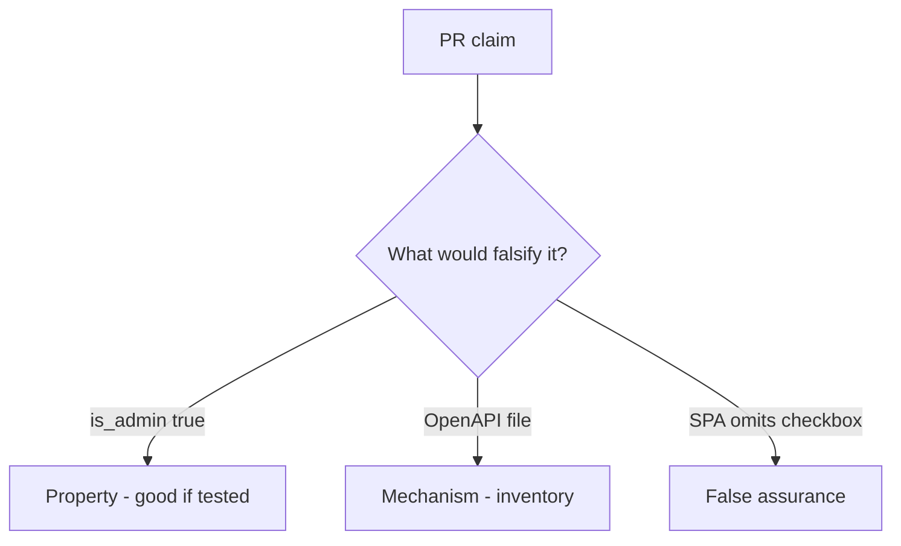

# 7.1-LO-08 — Review update(body) as a PR, not an API9 ticket

**Kind:** code-review
**Loop step:** Review
**Standards:** OWASP ASVS 5.0.0 (final) `v5.0.0-15.3.3`.

## Review the fixture as if it were SecureCollab profile PATCH

Review `labs/7.1/7.1-lab/vulnerable/` as a SecureCollab PR. Intended findings live only in `content/assessment/keys/7.1.md` — not here.

## Mental model: property, mechanism, or false assurance

Seeded smells (label them yourself; do not open the keys file):

- `user.update(body)` / `__dict__.update`
- Undocumented route not in inventory
- No `is_admin` deny test
- OpenAPI not generated from the running handlers

Also reject: public API attacks, keys in lessons, dumping Pydantic models as the lesson.

## Misconceptions

- If it is not in Swagger it cannot be called
- GraphQL is self-documenting therefore safe
- Versioning is a security control

## Practice

Write three review notes. Tie at least one to `test_is_admin_cannot_be_patched`.

## Transfer

Clinic PR that “documented the PATCH in OpenAPI” without an `is_staff` deny test is incomplete.
