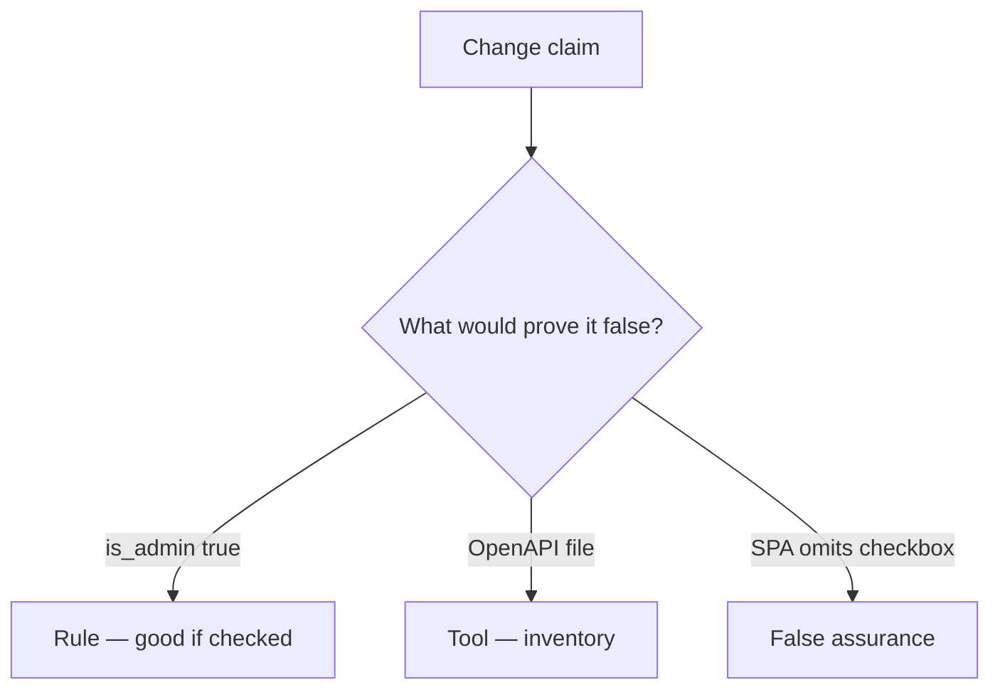

# Would you merge this update(body)?

**Kind:** code-review
**Loop step:** Review

## What you are reviewing

Review `labs/7.1/7.1-lab/vulnerable/` as a change to the notes app’s profile PATCH. Check whether `apply(..., {"is_admin": true})` still writes true.

A sticky note “we should allow-list later” is not `test_is_admin_cannot_be_patched` going green. An inventory ticket about leftover endpoints does not drop `is_admin`.

## Picture: user.update(body) / __dict__.update

**`user.update(body)` / `__dict__.update`**.

`is_admin` is still false. If the change never copies a server `ALLOWED` list, that extra-key leftover is still open. An OpenAPI file without that check is still the same problem.

A missing SPA checkbox (3.4’s client leftover, restated for fields) does not bind `apply`. Leftover `/v0` and GraphQL `input: JSON` are other binders — name them, do not skip `test_is_admin_cannot_be_patched`.

## Problems to find (name them yourself)

- `user.update(body)` / `__dict__.update`
- Undocumented route not in inventory
- No `is_admin` deny check
- OpenAPI not generated from the running handlers

Also reject: public API attacks; closing findings without re-running `test_is_admin_cannot_be_patched`; keys in learner notes; dumping Pydantic models as the lesson.

## Common mix-ups this topic refuses

- If it is not in Swagger it cannot be called
- GraphQL is self-documenting therefore extra mutation args are safe
- Versioning is a security control
- A complete OpenAPI file proves extra keys are ignored
- A leftover-endpoint nickname is the rule

## Use it somewhere new

A clinic change that “documented the PATCH in OpenAPI” without an `is_staff` deny check is an incomplete review. Name the independent falsehood that would still keep `is_staff` false.

## What this page is not doing

A PATCH that still writes `is_admin`, plus “will allow-list later,” has no owner. Do not probe a public API to prove the finding.
