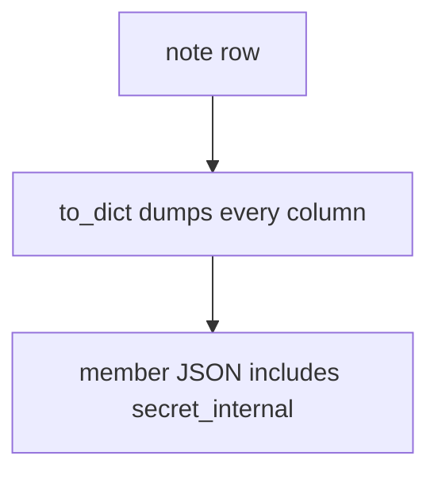
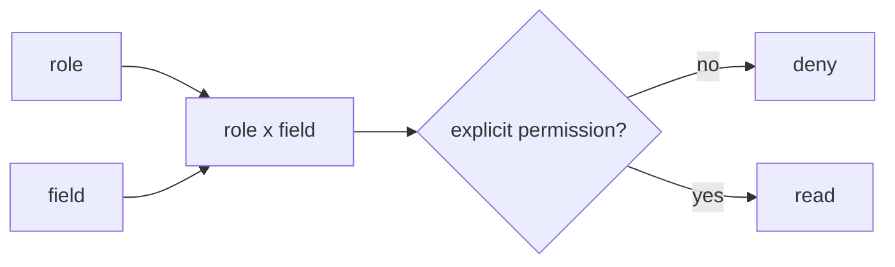

# Identifiers find a row; they do not authorize fields

**Kind:** concept-model
**Loop step:** 1 Property

## The rule

The notes app this week stores a note with a member-visible `display_name` and a service-only `secret_internal` (a fake integration token in this practice, not a real secret). Last topic on object grants (4.4) already said: a share on this note is a yes for **this row**. This week's rule is **which fields that share may read**. Extra keys on *write* were last week (7.1).

> `resolve("member", "secret_internal")` must be false. `resolve("member", "display_name")` may be true. `resolve("service", "secret_internal")` may be true.

What must not happen is **a member resolves `secret_internal`**. That is who-is-allowed at field grain. Being able to call GET `/notes` is not this sentence. A UUID in the URL finds the row. It does not authorize every column.

Field-level access has to be limited to consumers with an explicit yes. Function-level permission is coarser. Object-level permission was 4.4. Applying a role change through every serializer right away is **advanced**, not this week's check. Famous “broken object / property / function” lists are awareness after this table exists. They are not the syllabus.

## Picture: the dump helper writes every column



SQLAlchemy `to_dict()`, GraphQL default resolvers, and REST `?fields=` that echo column names are the same shape: the serializer is not a policy.

Who could do this: a member session that asks for extra fields. That stands in for a clinic GraphQL `Patient { ssn }`, a REST `?fields=` dump, or a CSV exporter that serializes every ORM column. What you trust is local `resolve(role, field)` on the server. Hiding the key in the SPA is not the rule.

**A tool is not the rule.** “Private JSON keys,” “GraphQL schema is typed,” “we already passed 4.4 object tests.”

## Picture: role times field is a table



A UUID locates the row. It is not a capability for every column. Hiding the key in the SPA is not the rule.

## Why it happens, what it costs, how you stop it, how you notice, how you recover

| Slice | For this rule |
|---|---|
| Why it happens | Serializer dumps the ORM object |
| What has to be true first | `resolve("member", "secret_internal")` is true |
| Trigger | Member requests the field (REST, GraphQL, CSV, search) |
| What it costs | Internal token or extra personal data |
| How you stop it | Allow-list fields by role at the trusted layer |
| How you notice | `field_denied` |
| How you recover | Rotate the leaked value; audit |

## What the framework does vs what you still have to check

ORM dump helpers are convenience, not field permission. GraphQL will resolve any field the schema exposes. FastAPI `response_model` helps only if it is the actual response, not an optional overlay.

What this practice is supposed to show: `resolve`, member × `secret_internal` is false. The practice folder is `labs/7.2/7.2-lab`. It is local. No live GraphQL.

## What the tool cannot do

- UI hide, GraphQL `__typename` tricks, and “private” naming are not mediation.
- CSV export, search snippets, debug toolbar, and later workers (7.4) are additional serializers.
- After a role change, a cached dump can still leak. That leftover is advanced.

## Can people still use it

Members still need `display_name`. Deny must not look like “note not found” if the object grant succeeded — that confuses screen readers and operators. Do not put the secret in the error.

## Practice

Draw role × field. Then run:

```text
python3 -m pytest labs/7.2/7.2-lab/tests --impl vulnerable
python3 -m pytest labs/7.2/7.2-lab/tests --impl fixed
```

Tie the check to `resolve("member", "secret_internal")`, not to a scanner bug name.

## Use it somewhere new

A clinic example: a member cannot resolve SSN. Also name bulk update and search highlighting that leaks snippets.

## What this page is not doing

Live GraphQL attacks, dumping ORM models into notes. This page does not finish a check-in. Answer keys are not on this site.
