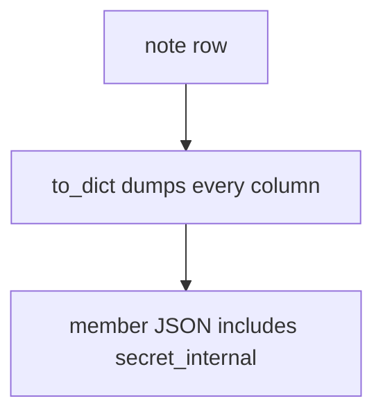
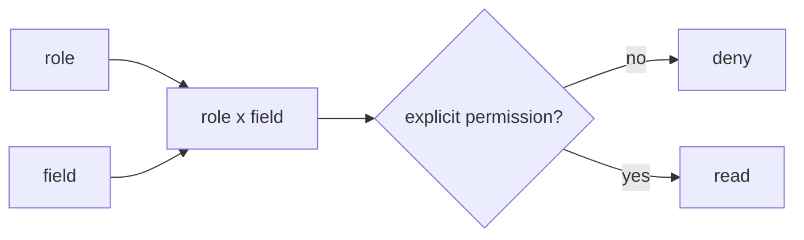

# 7.2-LO-01 — Identifiers locate; they do not authorize fields

**Kind:** concept-model
**Loop step:** 1 Property
**Standards:** OWASP ASVS 5.0.0 (final) `v5.0.0-8.2.3`, `v5.0.0-8.2.1`, `v5.0.0-8.2.2`; `v5.0.0-8.3.2` is **Level 3, advanced**. API1/API3/API5 are *awareness after* the cause (also 4.4).

## The claim this module owns

SecureCollab notes have a member-visible `display_name` and a service-only `secret_internal` (integration token, not a real secret in the lab). Module 4.4 already required object×tenant grants. This module’s grain is **which fields that grant may read**. Module 7.1 was extra keys on *write*.

> `resolve("member", "secret_internal")` must be false. `resolve("member", "display_name")` may be true. `resolve("service", "secret_internal")` may be true.

The forbidden outcome is **member resolves `secret_internal`**. That is authorization at property grain (BOPLA), not “they can call GET `/notes`.”

ASVS `v5.0.0-8.2.3` wants field-level access restricted to consumers with explicit permissions. `v5.0.0-8.2.1` is function-level. `v5.0.0-8.2.2` is object-level (4.4). `v5.0.0-8.3.2` (authorization changes applied immediately, including through serializers) is **Level 3, advanced**.

## Mental model: serializer dumps the ORM



SQLAlchemy `to_dict()`, GraphQL default resolvers, and REST `?fields=` that reflect column names are the same shape: the serializer is not a policy.

## Mental model: role times field



A UUID in the URL locates the row. It is not a capability for every column. Hiding the key in the SPA is not the cell.

**Mechanism (not the property):** “private JSON keys,” “GraphQL schema is typed,” “we already passed 4.4 object tests.”

## Root cause vs impact vs prevention vs detection vs recovery

| Slice | For this property |
|---|---|
| Root cause | Serializer dumps the ORM object |
| Preconditions | `resolve("member", "secret_internal")` is true |
| Trigger | Member requests the field (REST, GraphQL, CSV, search) |
| Impact | Internal token or PII extra |
| Prevention | Allow-list fields by role at the trusted layer |
| Detection | `field_denied` |
| Recovery | Rotate the leaked value; audit |

## Framework defaults versus the field guarantee

ORM dump helpers are convenience, not 8.2.3. GraphQL will resolve any field the schema exposes. FastAPI `response_model` helps only if it is the actual response, not an optional overlay.

## Mechanism limits

- UI hide, GraphQL `__typename` tricks, and “private” naming are not mediation.
- CSV export, search snippets, debug toolbar, and 7.4 workers are additional serializers.
- After a role change, a cached dump can still leak (`v5.0.0-8.3.2`, Level 3).

## Usability and accessibility

Members still need `display_name`. Deny must not look like “note not found” if the object grant succeeded (confuses assistive tech and operators). Do not put the secret in the error.

## Practice

Draw role × field. Then run:

```
python3 -m pytest labs/7.2/7.2-lab/tests --impl vulnerable
python3 -m pytest labs/7.2/7.2-lab/tests --impl fixed
```

The first command must fail. The second must pass.

## Transfer

Clinic member cannot resolve SSN. Bulk update. Search highlighting leaking snippets.

## Non-goals

Live GraphQL attacks, dumping ORM models into notes. Gates 0–10 and milestones M0–M5 stay **not-attempted**. Answer keys are not in this file.
