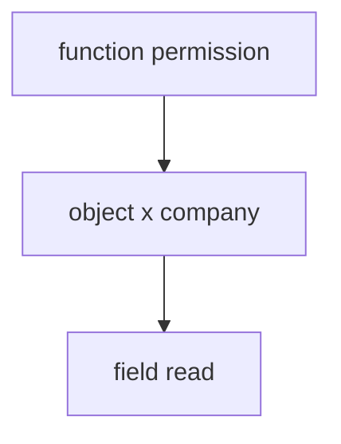
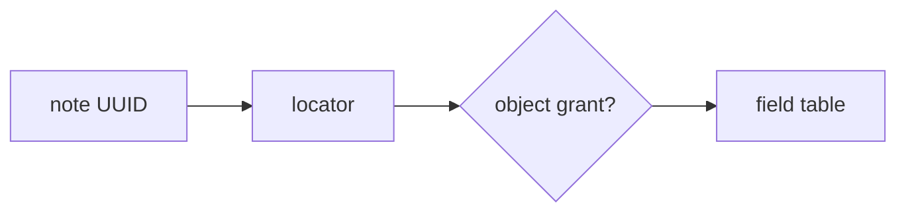

# Role times field is a table, not a dump

**Kind:** design-exercise
**Loop step:** 2 Model

## Could someone else name the checks from your field table?

“Object authz is on” is not this page. A table someone else can test names **role, field, and every serializer**.

`resolve(role, field)` — no live GraphQL.

## Picture: three grains

Passing GET `/notes/{id}` (4.4) does not decide `secret_internal`. Passing last week’s extra-key write check (cannot *write* `is_admin`) does not decide who may *read* a field.

## Picture: a UUID is not a grant

Identifiers find a row. They do not authorize fields. Obscure identifiers are not capabilities. Famous “broken object / property / function” lists are awareness after this sentence.

## Step 1: name the pieces

| Piece | This system |
|---|---|
| Who | member; service role |
| What | `display_name`; `secret_internal` |
| Actions | `resolve` |
| Paths | REST JSON; GraphQL; CSV; search |
| What you trust | server-side role × field |
| What you do not trust | `?fields=`; GraphQL selection sets; UI hide |
| Time | current role; cached dump after a role change is advanced leftover |
| The cell | who-is-allowed at field grain |

## Step 2: write cells the practice can fail

| Who | What | Action | Decision |
|---|---|---|---|
| member | `display_name` | resolve | allow |
| member | `secret_internal` | resolve | deny |
| service | `secret_internal` | resolve | allow-audited |
| SPA hide | `secret_internal` | omit | not what you trust |

## Practice

In `labs/7.2/7.2-lab`, mark `field.py`.

## Use it somewhere new

SSN as a field, search snippets, and bulk update of hidden fields share this map (write grain is 7.1, read grain is here).

## What can still go wrong

Later worker dumps (7.4). Stale serializers after a role change (advanced). Debug toolbar.

## What this page is not doing

Naming mass assignment does not drop `secret_internal`. Answer keys are not on this site.
