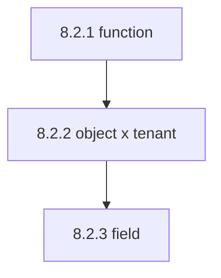
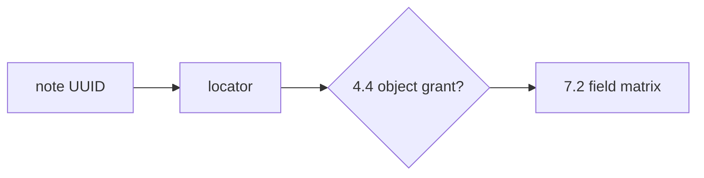

# 7.2-LO-02 — Role times field is a matrix, not a serializer dump

**Kind:** design-exercise
**Loop step:** 2 Model
**Standards:** OWASP ASVS 5.0.0 (final) `v5.0.0-8.2.3`, `v5.0.0-8.2.2`.

## Can a second engineer name pytest cases from your field matrix?

“Object authz is on” is not this lesson. A reviewable model names **role, field, and every serializer**.

SecureCollab Phase 1 freeze: local `resolve(role, field)`. No live GraphQL.

## Mental model: three grains

Passing GET `/notes/{id}` (4.4) does not decide `secret_internal`. Passing 7.1 (cannot *write* `is_admin`) does not decide who may *read* it.

## Mental model: UUID is not a grant

Obscure identifiers are not capabilities. API1/API3/API5 are awareness after this sentence.

## Step 1: freeze pieces

| Piece | This system |
|---|---|
| Subjects | member; service role |
| Objects | `display_name`; `secret_internal` |
| Actions | `resolve` |
| Channels | REST JSON; GraphQL; CSV; search |
| TCB | server-side role×field |
| Untrusted | `?fields=`; GraphQL selection sets; UI hide |
| State / time | current role; Level 3 cache after role change |
| 1.1 cell | authorization at property grain |

## Step 2: write cells

| Subject | Object | Action | Decision |
|---|---|---|---|
| member | `display_name` | resolve | allow |
| member | `secret_internal` | resolve | deny |
| service | `secret_internal` | resolve | allow-audited |
| SPA hide | `secret_internal` | omit | not TCB |

## Practice

Draw the matrix. Point at `labs/7.2/7.2-lab` file `field.py`.

## Transfer

Clinic SSN; search snippets; bulk update of hidden fields (write grain is 7.1, read grain is this map).

## Residual risk

7.4 worker dumps; `v5.0.0-8.3.2` Level 3 stale serializers; debug toolbar.

## Non-goals

Top 10 as the definition of security. Keys stay out of lessons.
