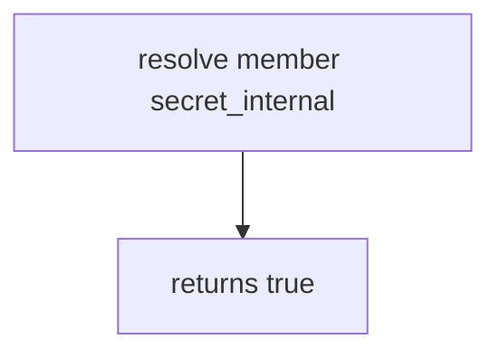

# 7.2-LO-03 — Observe always-true resolve, do not trophy a public GraphQL API

**Kind:** mechanism-lab
**Loop step:** 3 Break
**Standards:** OWASP ASVS 5.0.0 (final) `v5.0.0-8.2.3`.

## Authorized scope

`labs/7.2/7.2-lab` only. Synthetic roles and field names. No live GraphQL.

**Forbidden outcome:** Member resolves `secret_internal`.

## Mental model: every field is visible



The vulnerable tree demonstrates **cause** (no field matrix). Do not query anything except this fixture.

## What to read in the fixture

`vulnerable/field.py` returns true for every pair. Tests require member × `secret_internal` to be false.

## Root cause vs impact

| Slice | Lab |
|---|---|
| Root cause | Serializer / resolver dumps without a matrix |
| Impact | Internal field extra |
| Not the lesson | API3 as the definition |

## Practice

```
python3 -m pytest labs/7.2/7.2-lab/tests --impl vulnerable
```

Record `test_member_cannot_resolve_internal_field`. Do not probe public hosts.

## Transfer

Clinic SSN. Predict without leaving this directory.

## Non-goals

No live-target instructions. Synthetic field names only — `secret_internal` is a lab label, not a production token.
