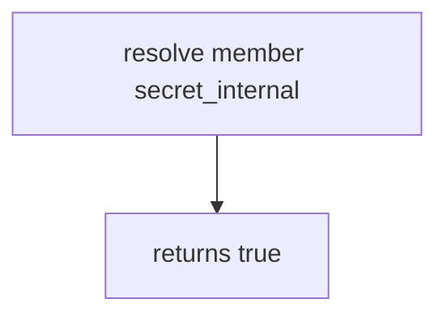

# Practice: a member resolves secret_internal

**Kind:** mechanism-lab
**Loop step:** 3 Break

## Try it

The practice is not a website you attack. `resolve(role, field)` returns true for every pair, so a member resolving `secret_internal` already gets the field. You do not need an internal-token dump.

> `resolve("member", "secret_internal")` must be false. If it is true, the serializer dumped without a field table.

## Where you may practice

Stay inside `labs/7.2/7.2-lab`. Fake roles (`member`, `service`) and field names (`display_name`, `secret_internal`). `secret_internal` is a lab label, not a production token. It does not open FastAPI or GraphQL. Do not query a public GraphQL host, an employer API, or a live clinic.

Do not paste this exercise onto a public site, employer board, or live clinic portal.

What must not happen: **a member resolves `secret_internal`**. `resolve("member", "secret_internal")` returns true.

Picture a member session selecting extra fields — a clinic GraphQL `Patient { ssn }`, a REST `?fields=` dump, or a CSV exporter that serializes every ORM column. `resolve` is supposed to be a **role × field table** at the trusted layer — not A SPA that omits the column, a UUID in the URL, or GraphQL `@hide` the client can skip.

## Picture: every field is visible



There is no field table. Do not query anything except this practice. `resolve` returns true for every pair. You do not need HTTP. You must not query a public GraphQL host.

Identifiers find a row. They do not authorize fields. Object×company grants were 4.4; this rule is **which fields that grant may read**. Extra keys on *write* were 7.1.

## What to read in the broken files

`vulnerable/field.py` returns true for every pair. Checks:

- `test_member_cannot_resolve_internal_field`
- `test_member_can_resolve_display_name`
- `test_service_can_resolve_internal_field` — honest service path; may pass on both

## Why it happens vs what it costs

| Slice | This practice |
|---|---|
| Required rule | `resolve("member", "secret_internal")` is false |
| Why it happens | Serializer / resolver dumps without a table |
| What's already wrong | `resolve` is always true |
| Trigger | Member requests the field (REST, GraphQL, CSV, search) |
| What it costs | Internal field extra; in production, token or extra personal data |
| How you stop it | Allow-list fields by role at the trusted layer |
| How you notice | `field_denied` with field *name*; never the secret |
| How you recover | Keep deny; rotate if the value escaped |
| Not the lesson | A bug-list sticker, object GET as this grain, or live GraphQL |

## What the framework does vs what you still have to check

ORM dump helpers are convenience, not field permission. GraphQL will resolve any field the schema exposes. FastAPI `response_model` helps only if it is the actual response. Next.js hiding a table column does not bind `resolve`. Member × `secret_internal` is false.

## Practice

Run checks against the broken files (they **must fail** on member × `secret_internal`). Record the check name `test_member_cannot_resolve_internal_field`.

```text
python3 -m pytest labs/7.2/7.2-lab/tests --impl vulnerable
```

Run from `labs/7.2/7.2-lab` if a repo-root collection picks up `site/`. Do not “fix” the check to pass. Do not probe public hosts. A setup error is not proof the rule holds.

## Use it somewhere new

SSN as a *field name* on local practice files is the leftover. Predict without leaving this directory. Do not query a live EHR.

## What this page is not doing

No live-target steps. Fake field names only — `secret_internal` is a lab label, not a production token. No real SSNs.
