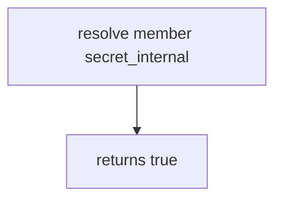

# 7.2-LO-03 — Observe always-true resolve, do not trophy a public GraphQL API

**Kind:** mechanism-lab
**Loop step:** 3 Break
**Standards:** OWASP ASVS 5.0.0 (final) `v5.0.0-8.2.3`. Object-level is 4.4 (`v5.0.0-8.2.2`). Immediate grant change through serializers (`v5.0.0-8.3.2`) is **Level 3, advanced**. API1/API3/API5 are awareness after the cause.

## Authorized scope

`labs/7.2/7.2-lab` only. The fixture is an in-process `resolve(role, field)`. Synthetic roles (`member`, `service`) and field names (`display_name`, `secret_internal`). `secret_internal` is a lab label, not a production token. No live GraphQL, no real SSNs, no public schema introspection against a clinic.

**Forbidden outcome:** Member resolves `secret_internal`. `resolve("member", "secret_internal")` returns true.

Attacker capability in this lab: a member session selecting extra fields. That stands in for a clinic GraphQL `Patient { ssn }`, a REST `?fields=` dump, or a CSV exporter that serializes every ORM column. Trust assumption: `resolve` is supposed to be a **role × field matrix** at the trusted layer. A SPA that omits the column, a UUID in the URL, and GraphQL `@hide` the client can skip are not in the TCB for this cell.

## Mental model: every field is visible



The vulnerable tree demonstrates **cause** (no field matrix). Do not query anything except this fixture. Preconditions: `resolve` returns true for every pair. You do not need HTTP. You must not query a public GraphQL host.

ASVS `v5.0.0-8.2.3` wants field-level access restricted to consumers with explicit permissions. Module 4.4 already required object×tenant grants; this cell is **which fields that grant may read**. Module 7.1 was extra keys on *write*.

## What to read in the fixture

`vulnerable/field.py` returns true for every pair. Tests:

- `test_member_cannot_resolve_internal_field`
- `test_member_can_resolve_display_name`
- `test_service_can_resolve_internal_field` — honest service path; may pass on both

You do not need a new secret name. The failure of `test_member_cannot_resolve_internal_field` *is* the evidence.

Do not open the fixed tree yet. Diagnose the cause first.

## Root cause vs impact vs prevention vs detection vs recovery

| Slice | This lab |
|---|---|
| Required property | `resolve("member", "secret_internal")` is false |
| Root cause | Serializer / resolver dumps without a matrix |
| Preconditions | `resolve` is always true |
| Trigger | Member requests the field (REST, GraphQL, CSV, search) |
| Impact | Internal field extra; in production, token or PII extra |
| Prevention | Allow-list fields by role at the trusted layer |
| Detection | `field_denied` with field *name*; never the secret |
| Recovery | Keep deny; rotate if the value escaped |
| Not the lesson | API3 as the definition; object GET as this grain; live GraphQL |

## Framework defaults versus the field guarantee

ORM dump helpers are convenience, not 8.2.3. GraphQL will resolve any field the schema exposes. FastAPI `response_model` helps only if it is the actual response. Next.js hiding a table column does not bind `resolve`. The application guarantee is: **this** fixture, member × `secret_internal` is false.

## Practice

```text
python3 -m pytest labs/7.2/7.2-lab/tests --impl vulnerable
```

Run from `labs/7.2/7.2-lab` if a repo-root collection picks up `site/`. Record `test_member_cannot_resolve_internal_field`. Do not probe public hosts. An environment error is not security evidence.

## Transfer

Clinic SSN as a *field name* on a local fixture. Predict without leaving this directory. Do not query a live EHR.

## Non-goals

No live-target instructions. Synthetic field names only — `secret_internal` is a lab label, not a production token. No real SSNs.
