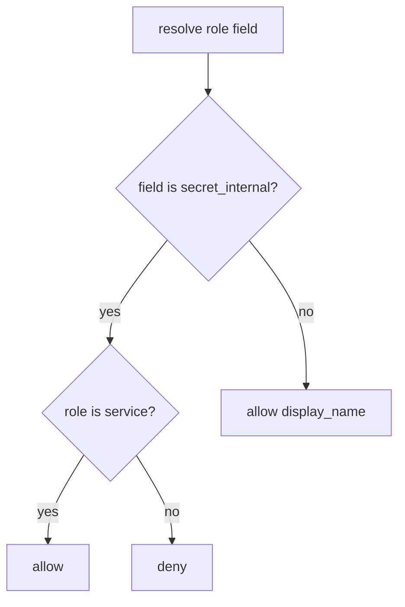

# Allow-list fields by role

**Kind:** design-exercise
**Loop step:** 4 Build

## The rule

Hiding the column in the SPA is not the fix. GraphQL `@hide` the client can skip is not the fix. A REST field name that starts with `_` is not the fix. “We already passed object GET tests” is not the fix.

The structural change is: the trusted layer **checks role × field**. `resolve` must deny `secret_internal` unless `role == "service"`. Structural means that predicate — not a hidden SPA column.

The smallest restore for the notes app’s note JSON is: deny member × `secret_internal`. Fail closed: unknown roles deny the internal field. Do not fail open because the serializer cache still holds yesterday’s dump.

## Picture: field deny unless listed



The repaired files check `role == "service"` only for `secret_internal`. Production still needs the table restated for CSV, search snippets, debug toolbar, and later workers (7.4). Object GET success (4.4) is a coarser grain — identifiers find a row; they do not authorize fields. Extra-key *writes* remain 7.1.

That explicit permission has to be implemented. This week's check is about member × `secret_internal`. Applying a role change through every serializer right away is **advanced**, not this week's check.

## What the repaired files must show

| After the fix | Must be true |
|---|---|
| member × `secret_internal` | false |
| member × `display_name` | true |
| service × `secret_internal` | true |

Fail closed: unknown roles deny the internal field. Do not keep the dump because “the UI hides it.”

## What this is not

Object GET tests only (4.4). Extra-key write tests only (7.1). UI omit. UUID as capability. GraphQL schema “private” naming. FastAPI `response_model` unused overlay.

## What the tool cannot do

- UI hide, GraphQL `__typename` tricks, and “private” naming are not mediation.
- CSV export, search snippets, debug toolbar, and later workers (7.4) are additional serializers.
- After a role change, a cached dump can still leak (advanced leftover).
- Honest `display_name` XSS remains 6.2.

## Practice

Name the predicate (`secret_internal` only if `role == "service"`). Run `--impl fixed` (must pass):

```text
python3 -m pytest labs/7.2/7.2-lab/tests --impl fixed
```

## Use it somewhere new

A clinic example: stop treating “SSN not in the member table UI” as field authorization.

## What can still go wrong

CSV / search / later-worker serializers; stale cache after a role change (advanced); 4.4 object grain still required; 7.1 extra-key writes still required.

## What this page is not doing

Do not query a public GraphQL host. Do not claim a course gate from a hidden-column screenshot.
