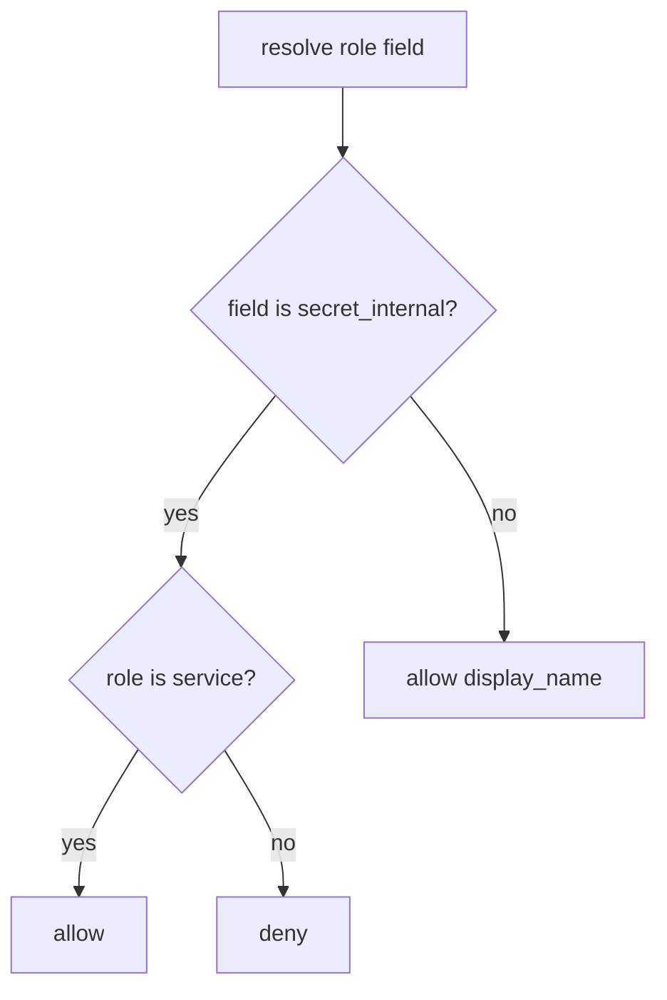

# 7.2-LO-04 — Allow-list fields by role

**Kind:** design-exercise
**Loop step:** 4 Build
**Standards:** OWASP ASVS 5.0.0 (final) `v5.0.0-8.2.3`. `v5.0.0-8.2.2` is object-level (4.4). `v5.0.0-8.3.2` immediate grant change is **Level 3, advanced**.

## Structural means the trusted layer checks role × field

`resolve` must deny `secret_internal` unless `role == "service"`. Structural means that predicate — not a GraphQL `@hide` directive the client can skip, not a REST field name that starts with `_`, not a hidden SPA column.

The smallest restore for SecureCollab note JSON is: deny member × `secret_internal`. Fail-safe: unknown roles deny the internal field. Do not fail open because the serializer cache still holds yesterday’s dump.

## Mental model: field deny unless listed



The lab’s fixed tree checks `role == "service"` only for `secret_internal`. Production still needs the matrix restated for CSV, search snippets, debug toolbar, and 7.4 workers (LO-02). Object GET success (4.4) is a coarser grain — it locates the row, it does not grant every column. Extra-key *writes* remain 7.1.

ASVS `v5.0.0-8.2.3` wants that explicit permission implemented. This pytest is that sentence for member × `secret_internal`.

## Why this restores the cell

| After the fix | Must be true |
|---|---|
| member × `secret_internal` | false |
| member × `display_name` | true |
| service × `secret_internal` | true |

## What this is not

Object GET tests only (4.4). Extra-key write tests only (7.1). UI omit. UUID as capability. GraphQL schema “private” naming. FastAPI `response_model` unused overlay.

## Mechanism limits

- UI hide, GraphQL `__typename` tricks, and “private” naming are not mediation.
- CSV export, search snippets, debug toolbar, and 7.4 workers are additional serializers.
- After a role change, a cached dump can still leak (`v5.0.0-8.3.2`, Level 3 advanced).
- Honest `display_name` XSS remains 6.2.

## Practice

Name the predicate (`secret_internal` only if `role == "service"`). Run:

```text
python3 -m pytest labs/7.2/7.2-lab/tests --impl fixed
```

Must pass. Run from the lab directory if collection at repo root is polluted.

## Transfer

Clinic: stop treating “SSN not in the member table UI” as field authorization.

## Residual risk

CSV/search/7.4 serializers; `v5.0.0-8.3.2` Level 3 after role change; 4.4 object grain still required; 7.1 extra-key writes still required.

## Non-goals

Do not query a public GraphQL host. Do not claim Gate 7 from a hidden column screenshot.
