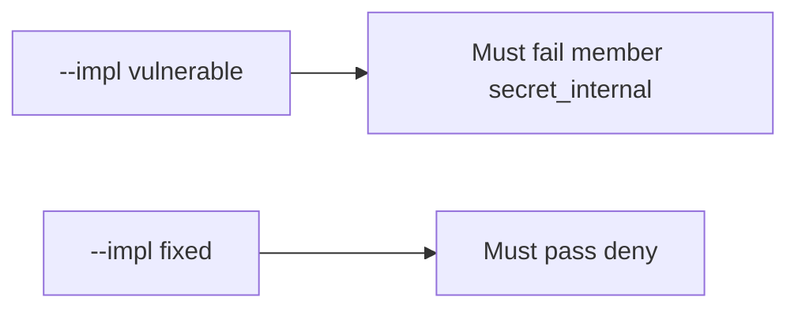

# Honest display_name vs secret_internal

**Kind:** verification-lab
**Loop step:** 5 Verify

## Check it

“Field authz is on” is not evidence. “The SPA hides the column” is a tool observation. The check is: `resolve("member", "secret_internal")` is false **and** `resolve("member", "display_name")` is true. The member-internal observation must be **false** on `--impl vulnerable` (returns true) and **true** on `--impl fixed`. Do not query public GraphQL.

## Picture: broken files must fail member × secret_internal

A passing-test tally can still hide that a member still resolves `secret_internal`. Honest `display_name` may pass on both — that is the product, not an excuse to skip the deny.



If both pass, you are not looking at the field table.

| Mode | Must show for this topic |
|---|---|
| Wrong input / abuse | member × `secret_internal` false; broken files must fail |
| Normal | member × `display_name` true (may pass on both) |
| Service | service × `secret_internal` true |
| Not claimed | object×company (4.4); extra-key writes (7.1); advanced cache leftover |

The checks are in `labs/7.2/7.2-lab/tests/test_property.py`. `test_member_cannot_resolve_internal_field` is there so a dump that always returns true still fails. `test_member_can_resolve_display_name` is the honest path.

```text
python3 -m pytest labs/7.2/7.2-lab/tests --impl vulnerable
python3 -m pytest labs/7.2/7.2-lab/tests --impl fixed
```

Honest `display_name` may pass on both implementations. That does not excuse the member-internal deny test. If the broken files do not fail `test_member_cannot_resolve_internal_field`, the lab is miswired — fix the wiring, not the assertion. A setup error is not proof the rule holds.

## What the checks do not prove

- Immediate grant change through caches (advanced leftover)
- CSV / search / worker serializers
- That GraphQL production matches REST
- Object×company (4.4) — a passing field test does not prove Bob cannot GET Alice’s note
- Extra-key writes (7.1)

## Practice

Do not treat a grep for `@hide` in a GraphQL schema as the check. Call `resolve("member", "secret_internal")`.

## Use it somewhere new

Asserting HTTP 200 on `/patients/{id}` is 4.4, not this check. Do not use a public GraphQL query.

## What this page is not doing

Do not treat a live schema screenshot as proof. Do not log `secret_internal` values. Answer keys are not on this site.
