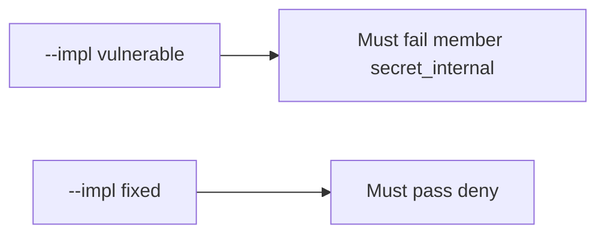

# 7.2-LO-05 — Evidence is member denied, then a passing pair

**Kind:** verification-lab
**Loop step:** 5 Verify
**Standards:** OWASP ASVS 5.0.0 (final) `v5.0.0-8.2.3`.

## An invariant that cannot fail a test is still a slogan

“Field authz is on” is not evidence. “The SPA hides the column” is a mechanism observation. The oracle is: `resolve("member", "secret_internal")` is false and `resolve("member", "display_name")` is true. The member-internal observation must be **false** on `--impl vulnerable` (returns true) and **true** on `--impl fixed`. Do not query public GraphQL.

## Mental model: vulnerable must fail: member secret_internal

The failing observation on `--impl vulnerable` is **member secret_internal**. A passing collection count is not this cell.



| Mode | Must show for this module |
|---|---|
| Negative / abuse | member × `secret_internal` false; vulnerable must fail |
| Normal | member × `display_name` true (may pass on both) |
| Service | service × `secret_internal` true |
| Not claimed | object×tenant (4.4); extra-key writes (7.1); Level 3 cache |

Lab tests in `labs/7.2/7.2-lab/tests/test_property.py`. `test_member_cannot_resolve_internal_field` is a **forbidden-outcome** test: a dump that always returns true is not allowed to count as a passing control.

```text
python3 -m pytest labs/7.2/7.2-lab/tests --impl vulnerable
python3 -m pytest labs/7.2/7.2-lab/tests --impl fixed
```

Honest `display_name` may pass on both implementations. That does not excuse the member-internal deny test. If vulnerable does not fail `test_member_cannot_resolve_internal_field`, the lab is miswired—fix the wiring, not the assertion.

## What the tests do not prove

- Immediate grant change through caches (`v5.0.0-8.3.2`, Level 3 advanced)
- CSV / search / worker serializers
- That GraphQL production matches REST
- Object×tenant (4.4) — a passing field test does not prove bob cannot GET alice’s note
- Extra-key writes (7.1)

Record those as residuals or later modules, not as silent passes.

## Practice

Execute both implementations this session from the lab directory if needed. Write the fail/pass pair next to the matrix row. Reject a “test” that only greps `@hide` in a GraphQL schema without calling `resolve("member", "secret_internal")`.

## Transfer

Clinic: a test that only asserts HTTP 200 on `/patients/{id}` is 4.4, not this cell. A public GraphQL query is out of scope.

## Non-goals

Do not add a live schema trophy. Do not log `secret_internal` values. Keys stay out of this file.
