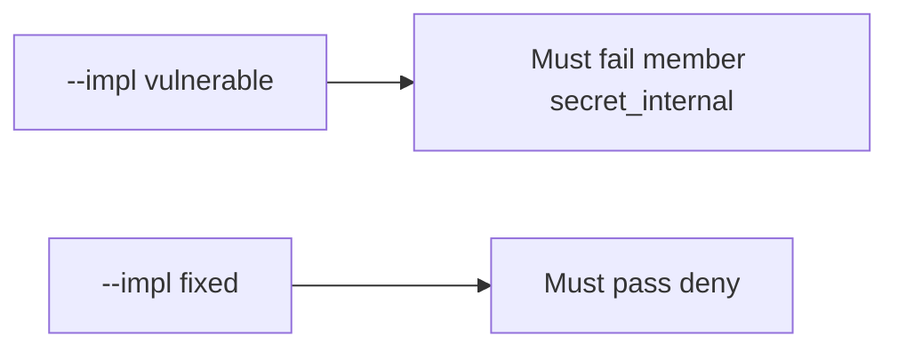

# 7.2-LO-05 — Evidence is member denied, then a passing pair

**Kind:** verification-lab
**Loop step:** 5 Verify
**Standards:** OWASP ASVS 5.0.0 (final) `v5.0.0-8.2.3`.

## An invariant that cannot fail a test is still a slogan

“Field authz is on” is not evidence. The oracle is the local pair. Do not query public GraphQL.

## Mental model: fail-on-vulnerable, pass-on-fixed



| Case | Must show |
|---|---|
| Negative / abuse | member × `secret_internal` false |
| Normal | member × `display_name` true |
| Service | service × `secret_internal` true |
| Not claimed | object×tenant (4.4); extra-key writes (7.1); Level 3 cache |

```
python3 -m pytest labs/7.2/7.2-lab/tests --impl vulnerable
python3 -m pytest labs/7.2/7.2-lab/tests --impl fixed
```

Honest `display_name` may pass on both.

## What the tests do not prove

- Immediate grant change through caches (`v5.0.0-8.3.2`, Level 3)
- CSV / search / worker serializers
- That GraphQL production matches REST

## Practice

Execute both implementations. Map each test to an LO-02 cell.

## Transfer

Clinic: a test that only asserts HTTP 200 on `/patients/{id}` is 4.4, not this cell.
