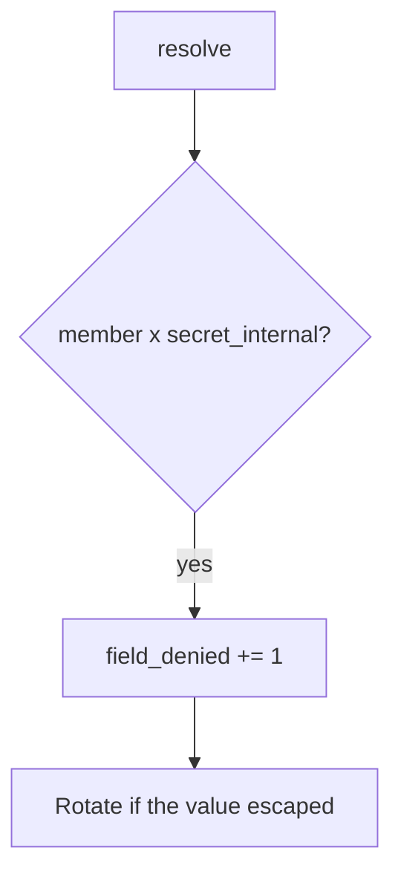

# 7.2-LO-06 — Detect field_denied without logging the secret

**Kind:** operations-exercise
**Loop step:** 6 Operate
**Standards:** NIST CSF 2.0 (final) DE/RS/RC as outcome labels; OWASP ASVS 5.0.0 (final) `v5.0.0-8.2.3`.

## Prevention is not absolute

A new CSV exporter can skip the GraphQL resolver. Pair detect and recover. Do not log `secret_internal` values (3.1).

## Mental model: denied field is a signal



| Outcome | This module |
|---|---|
| Detect | `field_denied` with field *name* |
| Signal | request id, subject id, field name; never the secret |
| Recover | Keep deny; rotate leaked integration tokens; fix the serializer |
| Residual | 7.4 dumps; Level 3 stale cache after role change |

## Practice

Write one log line you would accept. Tie it to `labs/7.2/7.2-lab`.

```
log_denied reason=field_denied field=secret_internal subject=user_72e request_id=req_72e
```

Reject any line that includes the field value, a real SSN, or a live GraphQL trace against a public host.

## Transfer

Clinic: detect SSN field probes; do not attach the SSN to the ticket.

## Non-goals

A GraphQL gateway product name is not the property.
