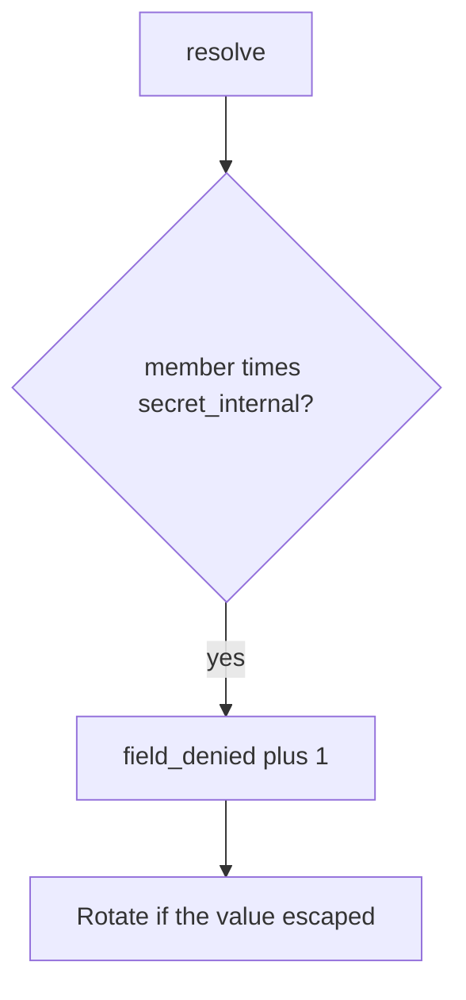

# Log the denied field, not the secret

**Kind:** operations-exercise
**Loop step:** 6 Operate

## Fixing it once is not enough

A CSV exporter or a later worker dump (7.4) can skip the GraphQL resolver. Do not write `secret_internal` into the ticket.

## Picture: denied field is a signal



A GraphQL-gateway product name does not check role × field or prove field permission. A member session still has to fail `test_member_cannot_resolve_internal_field`. “Field authz enabled” does not hide `secret_internal`. Search highlighting and overnight export can still dump `secret_internal`; the field is not private until those dumps are named.

## Signals that do not become a second leak

| Outcome | This topic |
|---|---|
| Notice | `field_denied` with field *name* |
| What the line holds | request id, subject id, field name; never the secret |
| Recover | Keep deny; rotate leaked integration tokens; fix the serializer |
| Leftover | Later worker dumps (7.4); stale cache after a role change (advanced); CSV/search paths |

## What the framework does vs what you still have to check

An APM dashboard will show GraphQL errors and stay silent when `/export.csv` still dumps every column. Notice must observe **member × `secret_internal` false**, not HTTP status counts. If the alert includes the field value, you have opened a logging leak (3.1).

A `field_denied` line fires without the secret.

## Can people still use it

If a human is denied a field they should not see, do not announce the secret in the error. Deny must not look like “note not found” if the object grant succeeded — that confuses screen readers and operators.

## Practice

```text
log_denied reason=field_denied field=secret_internal subject=user_72e request_id=req_72e
```

Reject any line that includes the field value, a real SSN, or a live GraphQL trace against a public host.

## Use it somewhere new

Detect SSN field probes on local practice files; do not attach the SSN to the ticket. Do not query a live EHR.

## What this page is not doing

A GraphQL-gateway sticker does not hide `secret_internal`. Do not follow public GraphQL probes. This site does not mark you as finished. Answer keys are not on this site.
