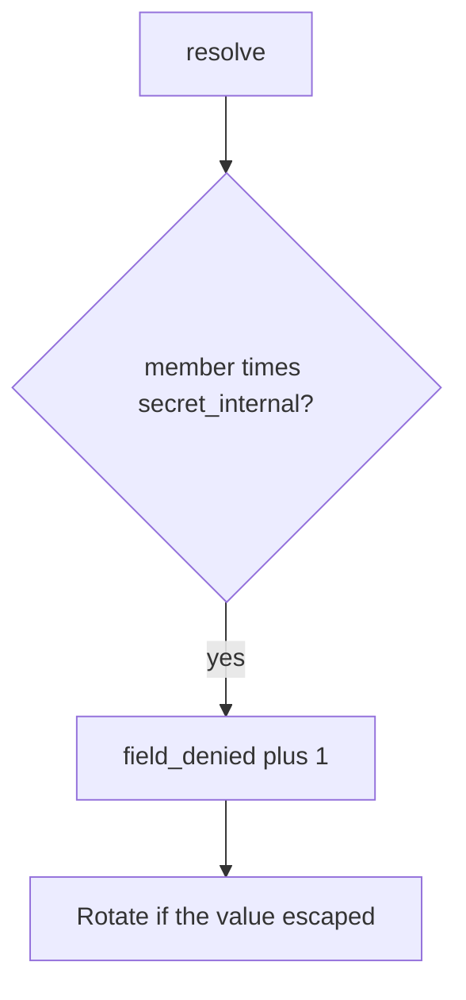

# 7.2-LO-06 — Detect field_denied without logging the secret

**Kind:** operations-exercise
**Loop step:** 6 Operate
**Standards:** NIST CSF 2.0 (final) DE/RS/RC as outcome labels; OWASP ASVS 5.0.0 (final) `v5.0.0-8.2.3`. CSF names outcomes; it does not check role × field.

## Prevention is not absolute

A new CSV exporter or 7.4 worker dump can skip the GraphQL resolver after `resolve` was “fixed once.” Pair detect and recover. Do not log `secret_internal` values (3.1). Do not attach the field value to the ticket.

## Mental model: denied field is a signal



| Outcome | This module |
|---|---|
| Detect | `field_denied` with field *name* |
| Signal | request id, subject id, field name; never the secret |
| Recover | Keep deny; rotate leaked integration tokens; fix the serializer |
| Residual | 7.4 dumps; Level 3 stale cache after role change; CSV/search paths |

CSF 2.0 Detect / Respond / Recover name outcomes. They do not prove `v5.0.0-8.2.3`. A GraphQL gateway product name is not the property. Re-run `test_member_cannot_resolve_internal_field` after any serializer change; a green “field authz enabled” tile is not that pytest. Search highlighting and overnight export are other dumps of the same row — inventory them before claiming Recover.

## Framework defaults versus the operate guarantee

An APM dashboard will show GraphQL errors and stay silent when `/export.csv` still dumps every column. Detection must observe **member × `secret_internal` false**, not HTTP status counts. If the alert includes the field value, you have opened a 3.1 cell.

## Practice

Write one log line you would accept. Tie it to `labs/7.2/7.2-lab`.

```text
log_denied reason=field_denied field=secret_internal subject=user_72e request_id=req_72e
```

Reject any line that includes the field value, a real SSN, or a live GraphQL trace against a public host.

## Transfer

Clinic: detect SSN field probes on a local fixture; do not attach the SSN to the ticket. Do not query a live EHR.

## Usability

If a human is denied a field they should not see, do not announce the secret in the error (WCAG 2.2 Success Criterion 4.1.3). Deny must not look like “note not found” if the object grant succeeded — that confuses assistive tech and operators (LO-01).

## Non-goals

A GraphQL gateway product name is not the property. Public GraphQL probes are out of scope. Gates 0–10 stay not-attempted.
