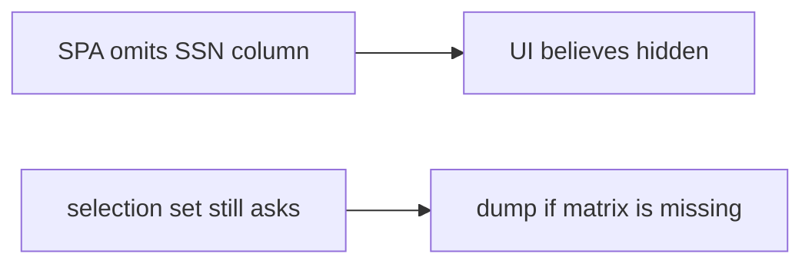

# A clinic member cannot resolve an SSN

**Kind:** transfer-challenge
**Loop step:** 7 Transfer

## Use it somewhere new

You get a **clinic sketch** with a patient page that omits the SSN column in the table, plus GraphQL `Patient { ssn }`. Also name bulk update and search highlighting that leaks snippets.

`resolve("member", "secret_internal")` must be false.

A member still must not resolve SSN. Also name bulk update and search highlighting leaking snippets.

EHR-lite patient page that omits the SSN column in the table, plus GraphQL `Patient { ssn }`.

## Picture: a hidden column is not field authorization

If the table omits the SSN column while `resolve` is always true, the rule is gone. FastAPI `response_model`, GraphQL “typed schema,” and UUID length do not check role × field. Identifiers find a row. They do not authorize fields. Search highlighting and CSV export are the same dump family — name them, do not run those systems here. A passing 4.4 object GET is a coarser grain: the member may read the *row* and still must not read the *field*.

Member × SSN still has to be false. Member × display name may still be true. Hiding SSN in the table without a member×field deny test leaves the serializer open. The local check is `test_member_cannot_resolve_internal_field` — on a practice, not a live EHR GraphQL query.

| Notes app | Clinic sketch |
|---|---|
| Member session asking for extra fields | Clinician session selecting extra fields — not a live clinic |
| `resolve("member", "secret_internal")` false | `resolve("member", "ssn")` false |
| Server role × field is what you trust | Same; UI omit and UUID are not |
| Search / CSV leftover | Search snippets, CSV, later workers, stale serializer cache |

## Write this for a clinic member cannot resolve SSN

1. who might try (clinician session selecting extra fields — not a live clinic);
2. what you trust (server role×field is what you trust; UI omit and UUID are not);
3. what must not happen (`resolve("member", "ssn")` true, not “HIPAA”);
4. a member must not resolve SSN — **local** practice files (no public EHR);
5. leftover (search snippets, CSV, later workers, stale serializer cache after a role change);
6. whenever a human path is in the claim (do not announce the SSN in an error).

Use synthetic labels (`ssn` as a field name in local practice files). Do not use real patient identifiers.

## What is not good enough

| Reject | Why |
|---|---|
| “UUID is secret” | Locator, not a grant |
| Live clinic / public GraphQL | Course rules |
| “We already have object authz” | 4.4 is a coarser grain |
| SPA omits column as field authz | Client is not what you trust |
| HTTP 200 on object GET as this rule | Wrong observation (4.4) |

## Practice

Hide `secret_internal` from the member query. Keep the answer keys closed. `labs/7.2/7.2-lab` is the only running system you may break. Do not query a public host.

## What this page is not doing

Do not try live-target GraphQL. Do not use real SSNs. This page does not finish a check-in.
