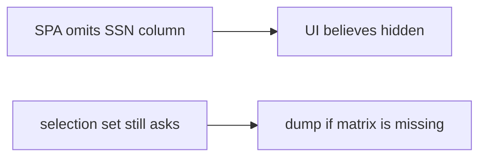

# 7.2-LO-07 — Transfer: clinic member cannot resolve SSN

**Kind:** transfer-challenge
**Loop step:** 7 Transfer
**Standards:** OWASP ASVS 5.0.0 (final) `v5.0.0-8.2.3`. API1/API3/API5 awareness after.

## Change the workplace; keep a role × field matrix

Do not answer with a Top 10 / CWE / scanner as the definition of security.

**Prompt:** Clinic member cannot resolve SSN. Also name bulk update and search highlighting leaking snippets.

**Product sketch:** EHR-lite patient page that omits the SSN column in the table, plus GraphQL `Patient { ssn }`.

Rewrite the SecureCollab sentence. Include:

1. attacker capabilities (clinician session selecting extra fields — not a live clinic);
2. trust assumptions (server role×field is TCB; UI omit and UUID are not);
3. forbidden outcome (`resolve("member", "ssn")` true, not “HIPAA”);
4. a test idea on a **local** fixture only (no public EHR);
5. residual (search snippets, CSV, 7.4 workers, Level 3 serializer cache);
6. WCAG if a human path is in the claim (do not announce the SSN in an error).

## Mental model: hidden column is not field authorization

Use synthetic labels (`ssn` as a field name in a local fixture). Do not use real patient identifiers.

## What graders reject

| Reject | Why |
|---|---|
| “UUID is secret” | Locator, not a grant |
| Live clinic / public GraphQL | Lab policy |
| “We already have object authz” | 4.4 is a coarser grain |

## Practice

One page. No keys. `labs/7.2/7.2-lab` is the only running system you may break.
