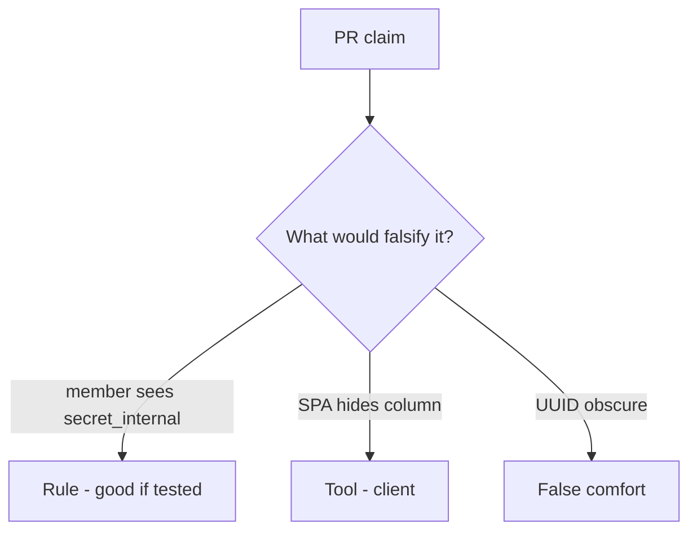

# Review ORM dumps like a pull request

**Kind:** code-review
**Loop step:** Review

Intended findings live only in the answer-key folder — not here. Do not open that file until your review has been evaluated.

## What you are reviewing

A colleague ships the notes app’s note JSON. Review `labs/7.2/7.2-lab/vulnerable/` as that change. Your job is not to count suspicious lines. Reconstruct whether `resolve("member", "secret_internal")` is still true, compare that with the rule, and write changes a developer can verify.

The check you already ran (`test_member_cannot_resolve_internal_field`) is the rule check. A comment “will matrix later” is not.

## Picture: resolver / dump always true

Start with this seeded smell: **resolver / dump always true**. Label it **rule**, **tool**, or **false comfort** before you accept the change.

Start from what must stay true (member denied `secret_internal`). Everything that is not a server role×field check at that call is a candidate dump path. A hidden SPA column without that check is the same problem, not a different kind of finding.

Identifiers find a row. They do not authorize fields. Object GET tests (4.4) do not bind this grain. CSV and later workers (7.4) are other serializers — name them, do not skip `test_member_cannot_resolve_internal_field`.

## Seeded smells (label them yourself)

- Resolver / dump always true
- GraphQL exposes all columns
- Object GET test only, not field
- UUID treated as a capability

Also reject: public GraphQL attacks; closing findings without re-running `test_member_cannot_resolve_internal_field`; keys in lessons; real personal data in practice files.

## Common mix-ups this topic refuses

- Object-level authz implies field-level
- Private JSON keys are hidden
- GraphQL resolvers inherit REST policy magically
- A UUID is a capability
- A famous-bugs nickname is the rule

## Practice

Write three review notes a maintainer could act on. Each note: what you saw, rule or false comfort, suggested structural change, leftover you will **not** delete. Tie at least one to `test_member_cannot_resolve_internal_field`. Do not open the keys file.

## Use it somewhere new

A clinic change that “hid SSN in the table” without a member×field deny test is an incomplete mediation review. Name the independent falsehood that would still keep member × SSN false.

## What this page is not doing

Do not merge by adding a comment “will matrix later.” That comment is leftover without an owner. Do not query a public GraphQL host to prove the finding.
