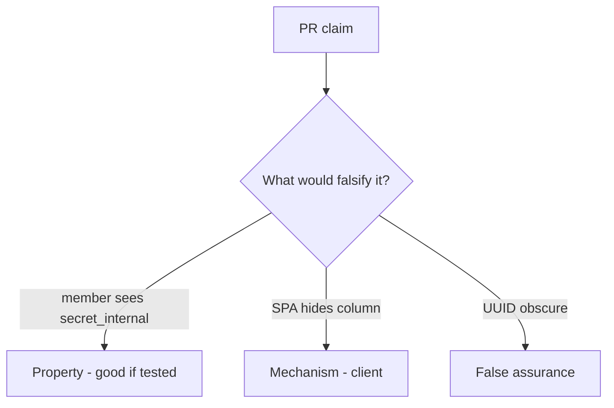

# 7.2-LO-08 — Review ORM dumps as a PR, not an API3 ticket

**Kind:** code-review
**Loop step:** Review
**Standards:** OWASP ASVS 5.0.0 (final) `v5.0.0-8.2.3`.

## Review the fixture as if it were SecureCollab note JSON

Review `labs/7.2/7.2-lab/vulnerable/` as a SecureCollab PR. Your job is not to count suspicious lines. Reconstruct whether `resolve("member", "secret_internal")` is still true, compare that with the module invariant, and write changes a developer can verify.

Intended findings live only in `content/assessment/keys/7.2.md` — not here. Do not open the keys file until your review has been evaluated.

## Mental model: Resolver / dump always true

Start with this seeded smell: **Resolver / dump always true**. Label it property, mechanism, or false assurance before you accept the PR.

Classification starts at the protected effect (member denied `secret_internal`). Everything that is not a server role×field check at that call is a candidate dump path. A hidden SPA column without that pytest is the same smell, not a different finding class.

Object GET tests (4.4) do not bind this grain. CSV and 7.4 workers are other serializers — name them, do not skip `test_member_cannot_resolve_internal_field`.

## Seeded smells (label them yourself)

- Resolver / dump always true
- GraphQL exposes all columns
- IDOR test only on object, not field
- UUID treated as a capability

Also reject: public GraphQL attacks; closing findings without re-running `test_member_cannot_resolve_internal_field`; keys in lessons; real PII in fixtures.

## Misconceptions this module refuses

- Object-level authz implies field-level
- Private JSON keys are hidden
- GraphQL resolvers inherit REST policy magically
- A UUID is a capability
- API3 is the property

## Practice

Write three review notes a maintainer could act on. Each note: observation, property or false assurance, suggested structural change, residual you will **not** delete. Tie at least one to `test_member_cannot_resolve_internal_field`.

## Transfer

Clinic PR that “hid SSN in the table” without a member×field deny test is an incomplete mediation review. Name the independent falsehood that would still keep member × SSN false.

## Non-goals

Do not merge by adding a comment “will matrix later.” That comment is a residual without an owner. Do not query a public GraphQL host to prove the finding.
