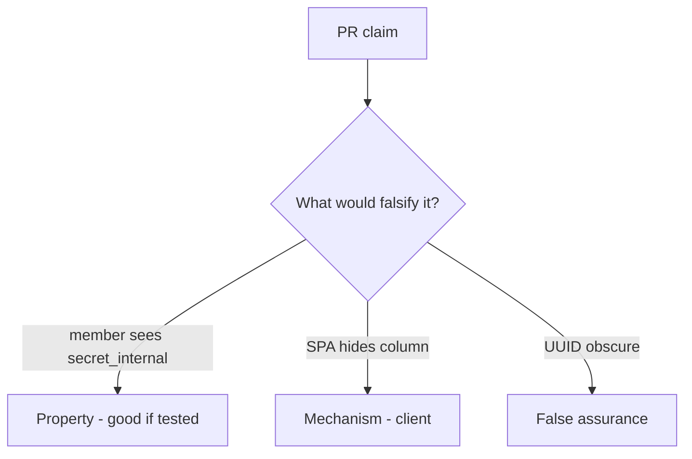

# 7.2-LO-08 — Review ORM dumps as a PR, not an API3 ticket

**Kind:** code-review
**Loop step:** Review
**Standards:** OWASP ASVS 5.0.0 (final) `v5.0.0-8.2.3`.

## Review the fixture as if it were SecureCollab note JSON

Review `labs/7.2/7.2-lab/vulnerable/` as a SecureCollab PR. Intended findings live only in `content/assessment/keys/7.2.md` — not here.

## Mental model: property, mechanism, or false assurance

Seeded smells (label them yourself; do not open the keys file):

- Resolver / dump always true
- GraphQL exposes all columns
- IDOR test only on object, not field
- UUID treated as a capability

Also reject: public GraphQL attacks, keys in lessons, real PII in fixtures.

## Misconceptions

- Object-level authz implies field-level
- Private JSON keys are hidden
- GraphQL resolvers inherit REST policy magically

## Practice

Write three review notes. Tie at least one to `test_member_cannot_resolve_internal_field`.

## Transfer

Clinic PR that “hid SSN in the table” without a member×field deny test is incomplete.
