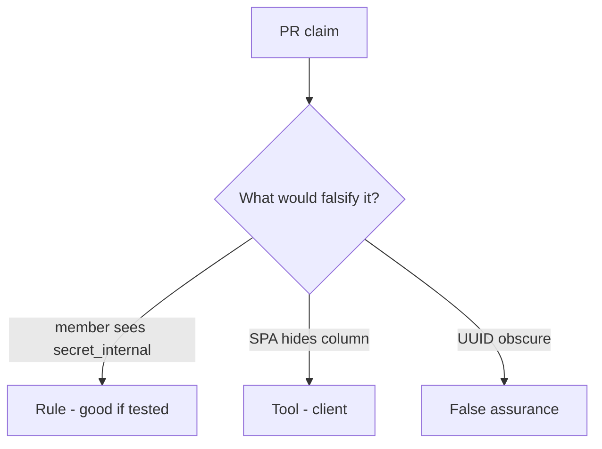

# Would you merge this ORM dumps?

**Kind:** code-review
**Loop step:** Review

## What you are reviewing

Review `labs/7.2/7.2-lab/vulnerable/` as a change to the notes app’s note JSON. Check whether `resolve("member", "secret_internal")` is still true.

You already ran `test_member_cannot_resolve_internal_field` — that is the rule. A comment “will matrix later” is not.

## Picture: resolver / dump always true

**resolver / dump always true**.

A member still has to be denied `secret_internal`. If the change never checks role×field on the server, that dump path is still open. A hidden SPA column without that check is still the same problem.

Identifiers find a row. They do not authorize fields. Object GET tests (4.4) do not bind this grain. CSV and later workers (7.4) are other serializers — name them, do not skip `test_member_cannot_resolve_internal_field`.

## Problems to find (name them yourself)

- Resolver / dump always true
- GraphQL exposes all columns
- Object GET test only, not field
- UUID treated as a capability

Also reject: public GraphQL attacks; closing findings without re-running `test_member_cannot_resolve_internal_field`; keys in lessons; real personal data in practice files.

## Common mix-ups this topic refuses

- Object-level authz implies field-level
- Private JSON keys are hidden
- GraphQL resolvers inherit REST policy magically
- A UUID is a capability
- A famous-bugs nickname is the rule

## Use it somewhere new

A clinic change that “hid SSN in the table” without a member×field deny test is an incomplete mediation review. Name the independent falsehood that would still keep member × SSN false.

## What this page is not doing

Do not merge by adding a comment “will matrix later.” That comment is leftover without an owner. Do not query a public GraphQL host to prove the finding.
