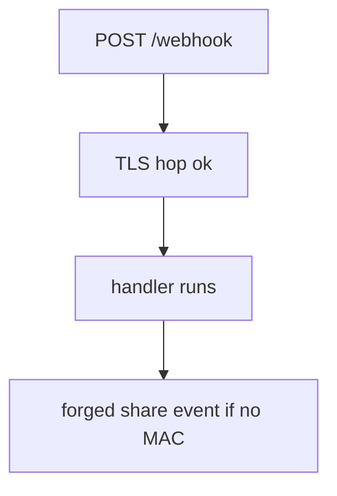
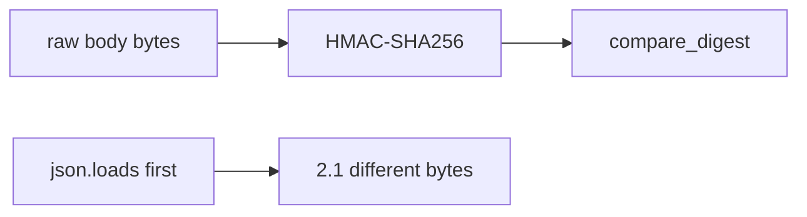

# Hitting the path is not proof the provider sent it

**Kind:** concept-model
**Loop step:** 1 Property

## The rule

The notes app may accept provider callbacks (billing, export-ready, invite used). Hitting `POST /webhook` over TLS proves a hop reached the socket (5.4). It does **not** prove the *message* came from the provider. Module 1.2 still applies to whatever the handler then writes.

> `accept("", "body", "lab-secret")` must be false. A matching HMAC over the same raw body may be true.

What must not happen is **an unsigned webhook body accepted**. That is authenticity and integrity of the inbound integration.

Use a standard-library MAC, not a homemade hash. Replay and freshness are leftovers, not this empty-sig check. Per-message digital signatures beyond HMAC are **advanced** work, not this check. A famous-bugs nickname for unsafe consumption of APIs is awareness after the cause. HMAC here is a teaching stand-in, not “we are Stripe.”

## Picture: hitting the path versus authenticity



Picture anyone who can POST the URL can send a body. An IP allow-list is shared-fate (NAT, shared cloud egress). It is not a MAC.

## Picture: MAC over raw bytes



If you parse JSON then re-serialize, the MAC is over a different document than the provider signed (2.1). A secret in a query string is 4.3.

**The tool (not the rule):** “the vendor SDK,” “TLS is on,” “allow-list the provider’s address range.”

## Why it happens, what it costs, how you stop it, how you notice, how you recover

| Slice | For this rule |
|---|---|
| Why it happens | The callback was trusted because it hit the path |
| What's already wrong | `accept("", body, secret)` is true |
| Trigger | An unauthenticated POST to the callback URL |
| What it costs | Forged share, billing, or lab-result events |
| How you stop it | MAC over the raw body; fail closed on a missing or wrong sig |
| How you notice | `webhook_sig_fail` |
| How you recover | Rotate the disposable secret; review accepted events |

## What the framework does vs what you still have to check

FastAPI will accept a POST with an empty header. A vendor SDK’s verify helper is not your custom MAC if you hash parsed JSON. JWT login of the *user* is a different rule.

`accept` is false when the signature is missing — files in `labs/7.3/7.3-lab`. Local only. No live webhooks.

## What the tool cannot do

- A correct signature still needs 1.2 on side effects.
- Replay of a valid MAC and stale timestamps remain leftover.
- Outbound webhook URLs are 6.5 (the server calling out), not this inbound MAC.
- If the provider is compromised, keep least privilege on what a webhook may do.
- Per-message signatures beyond HMAC are advanced work.

## Usability and accessibility

Provider retries on 5xx can amplify load (6.7). Return 4xx on a bad MAC so retries stop. Do not include the body in the error page.

## Practice

List: signature, raw body, time, replay, dest URL ownership. Then run:

```text
python3 -m pytest labs/7.3/7.3-lab/tests --impl vulnerable
python3 -m pytest labs/7.3/7.3-lab/tests --impl fixed
```

## Use it somewhere new

A lab-result webhook is this grain. Signed redirects are leftover. Outbound SSRF waits for 6.5.

## What this page is not doing

Do not use live Stripe/GitHub attacks, dumping HMAC cookbooks against public endpoints. This site does not mark you as finished. Answer keys are not on this site.
