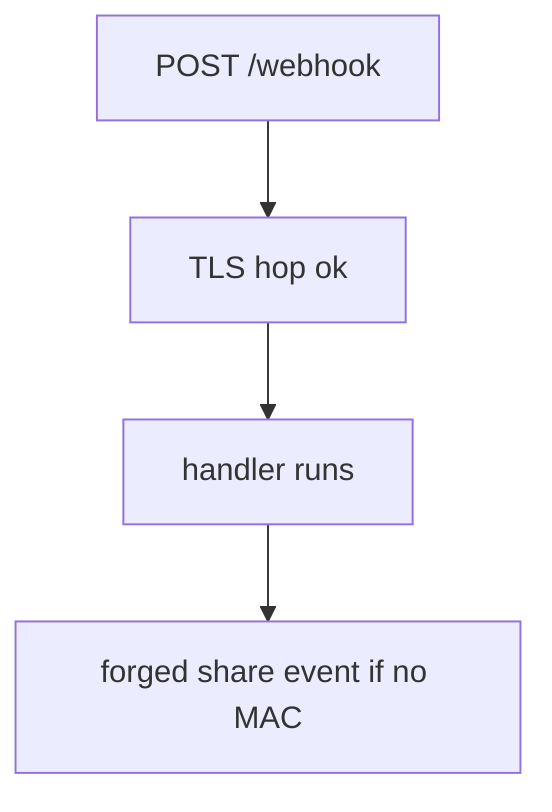
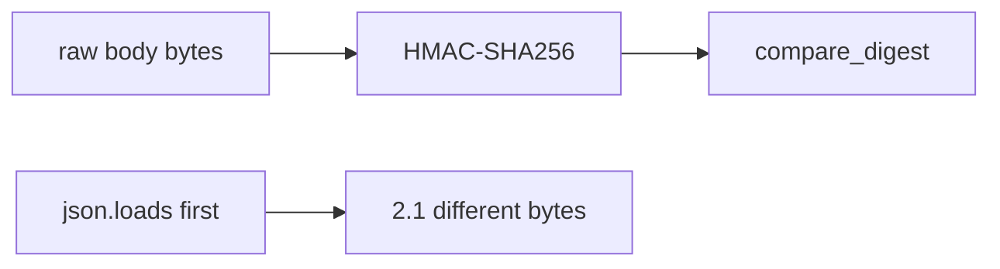

# 7.3-LO-01 — Path hit is not provider-message authenticity

**Kind:** concept-model
**Loop step:** 1 Property
**Standards:** OWASP ASVS 5.0.0 (final) `v5.0.0-11.2.1`, `v5.0.0-2.3.4`, `v5.0.0-2.3.3`; `v5.0.0-4.1.5` is **Level 3, advanced**. API10 is *awareness after* the cause. HMAC here is a teaching stand-in, not “we are Stripe.”

## The claim this module owns

SecureCollab may accept provider callbacks (billing, export-ready, invite consumed). Hitting `POST /webhook` over TLS proves a hop reached the socket (5.4). It does **not** prove the *message* came from the provider. Module 1.2 still applies to whatever the handler then writes.

> `accept("", "body", "lab-secret")` must be false. A matching HMAC over the same raw body may be true.

The forbidden outcome is **unsigned webhook body accepted**. That is authenticity and integrity of the inbound integration.

ASVS `v5.0.0-11.2.1` wants industry-validated cryptographic implementations (stdlib HMAC-SHA256 in the lab). `v5.0.0-2.3.4` / `v5.0.0-2.3.3` want replay and freshness — named residuals, not the missing-sig oracle. `v5.0.0-4.1.5` (per-message digital signatures on highly sensitive requests) is **Level 3, advanced**.

## Mental model: path hit versus authenticity



Anyone who can POST the URL can send a body. An IP allow-list is shared-fate (NAT, shared cloud egress) and is not a MAC.

## Mental model: MAC over raw bytes



If you parse JSON then re-serialize, the MAC is over a different document than the provider signed (2.1). Secret in a query string is 4.3.

**Mechanism (not the property):** “Stripe SDK,” “TLS is on,” “allow-list the provider CIDR.”

## Root cause vs impact vs prevention vs detection vs recovery

| Slice | For this property |
|---|---|
| Root cause | Callback trusted because it hit the path |
| Preconditions | `accept("", body, secret)` is true |
| Trigger | Unauthenticated POST to the callback URL |
| Impact | Forged share, billing, or lab-result events |
| Prevention | MAC over raw body; fail closed on missing/wrong sig |
| Detection | `webhook_sig_fail` |
| Recovery | Rotate disposable secret; review accepted events |

## Framework defaults versus the authenticity guarantee

FastAPI will accept a POST with an empty header. A vendor SDK’s verify helper is not your custom MAC if you hash parsed JSON. JWT login of the *user* is a different cell.

## Mechanism limits

- Correct signature still needs 1.2 on side effects.
- Replay of a valid MAC (`v5.0.0-2.3.4`) and stale timestamps (`v5.0.0-2.3.3`) remain.
- Outbound webhook URLs are 6.5 (SSRF), not this inbound MAC.
- Provider compromise: least privilege on what a webhook may do.
- Per-message signatures beyond HMAC (`v5.0.0-4.1.5`) are Level 3.

## Usability and accessibility

Provider retries on 5xx can amplify load (6.7). Return 4xx on bad MAC so retries stop. Do not include the body in the error page.

## Practice

List: signature, raw body, time, replay, dest URL ownership. Then run:

```
python3 -m pytest labs/7.3/7.3-lab/tests --impl vulnerable
python3 -m pytest labs/7.3/7.3-lab/tests --impl fixed
```

The first command must fail. The second must pass.

## Transfer

Clinic lab-result webhook. Signed redirects. Outbound SSRF (6.5).

## Non-goals

Live Stripe/GitHub attacks, dumping HMAC cookbooks against public endpoints. Gates 0–10 and milestones M0–M5 stay **not-attempted**. Answer keys are not in this file.
