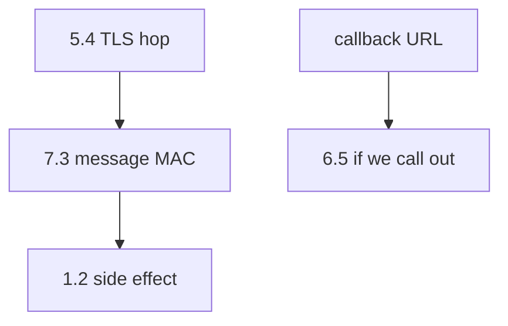
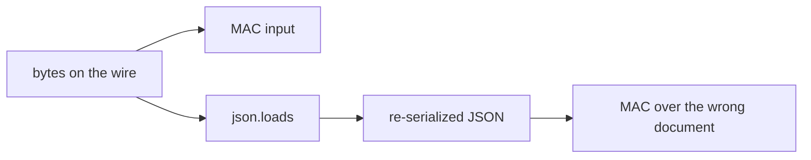

# MAC over raw bytes, not parsed JSON

**Kind:** design-exercise
**Loop step:** 2 Model

## Could someone else name the checks?

“TLS terminates at the edge” is not this lesson. A map someone else can test names **raw body**, **MAC**, **secret**, and **what happens on a missing sig**.

This week’s freeze for the notes app: local `accept(sig, body, secret)` with disposable `lab-secret`. No live providers.

> HMAC over the raw body bytes. Compare with `compare_digest`. An empty signature must deny. Parsed JSON is a second document.

## Picture: three different cells

## Picture: parsed JSON is a second document

Module 2.1 already treated parsed JSON as a different document. Here the MAC must cover the bytes the provider actually sent, not a dump you built after `json.loads`.

## Step 1: name the pieces

| Piece | This system |
|---|---|
| Who | anyone who can POST the URL; provider with `lab-secret` |
| What | callback body |
| Actions | `accept` |
| Paths | HTTP POST; signature header |
| What you trust | HMAC-SHA256 over the raw body + `compare_digest` |
| What you do not trust | body, signature header, source IP |
| Time | replay window (named leftover) |
| The rule | authenticity and integrity of the inbound integration |

## Step 2: write allow and deny

| Who | What | Action | Decision |
|---|---|---|---|
| unsigned POST | body | accept | deny |
| matching MAC | same raw body | accept | allow |
| wrong MAC | body | accept | deny |
| TLS only | path | POST | not authenticity |
| parsed-then-MAC | re-serialized | accept | 2.1 leftover |

A missing “unsigned POST × accept × deny” row is how a path-trusted callback appears. Write the hole.

## Practice

Draw the map so someone else could name the checks. Point at `labs/7.3/7.3-lab` file `hook.py`. Local only. Do not POST a live webhook.

## Use it somewhere new

Clinic lab-result webhook. Signed redirects.

## What can still go wrong

Replay; freshness; 1.2 on side effects; 6.5 outbound; per-message signatures beyond HMAC (advanced).

## What this page is not doing

Do not define security as a famous-bugs list. Do not run this map against a live clinic or a live provider. Answer keys are not on this site.
