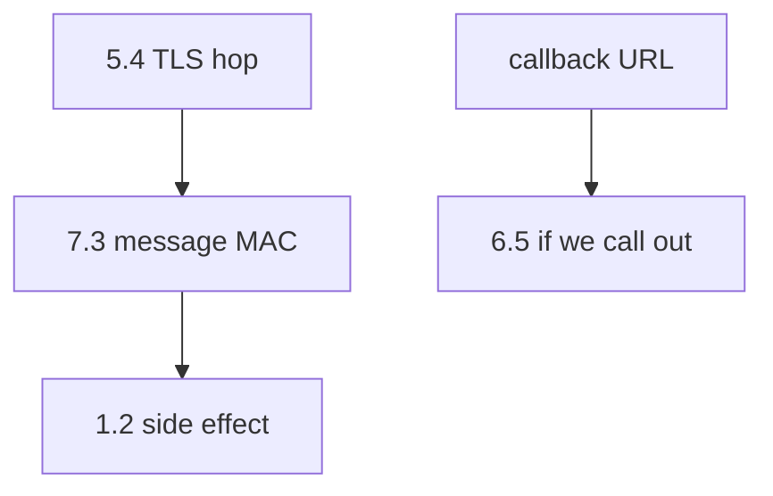
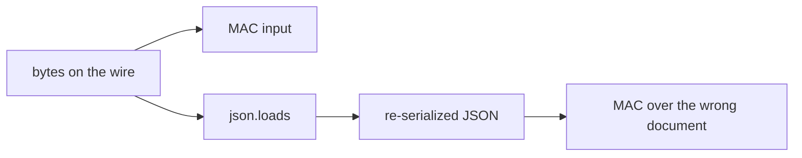

# 7.3-LO-02 — MAC over raw bytes, not parsed JSON

**Kind:** design-exercise
**Loop step:** 2 Model
**Standards:** OWASP ASVS 5.0.0 (final) `v5.0.0-11.2.1`, `v5.0.0-2.3.4`.

## Can a second engineer name pytest cases from your webhook map?

“TLS terminates at the edge” is not this lesson. A reviewable model names **raw body, MAC, secret, and what happens on missing sig**.

SecureCollab Phase 1 freeze: local `accept(sig, body, secret)` with disposable `lab-secret`. No live providers.

## Mental model: three different cells

## Mental model: parsed JSON is a second document

## Step 1: freeze pieces

| Piece | This system |
|---|---|
| Subjects | anyone who can POST the URL; provider with `lab-secret` |
| Objects | callback body |
| Actions | `accept` |
| Channels | HTTP POST; signature header |
| TCB | HMAC-SHA256 over raw body + `compare_digest` |
| Untrusted | body, signature header, source IP |
| State / time | replay window (named residual) |
| 1.1 cell | authenticity + integrity of inbound integration |

## Step 2: write cells

| Subject | Object | Action | Decision |
|---|---|---|---|
| unsigned POST | body | accept | deny |
| matching MAC | same raw body | accept | allow |
| wrong MAC | body | accept | deny |
| TLS only | path | POST | not authenticity |
| parsed-then-MAC | re-serialized | accept | 2.1 residual |

## Practice

Draw the map. Point at `labs/7.3/7.3-lab` file `hook.py`.

## Transfer

Clinic lab-result webhook; signed redirects.

## Residual risk

Replay (`v5.0.0-2.3.4`); freshness (`v5.0.0-2.3.3`); 1.2 on side effects; 6.5 outbound; `v5.0.0-4.1.5` Level 3.

## Non-goals

Top 10 as the definition of security. Keys stay out of lessons.
