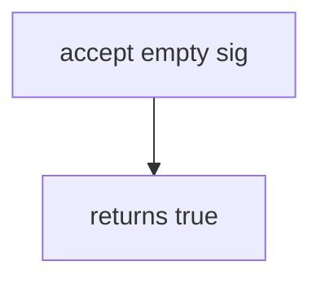

# 7.3-LO-03 — Observe always-true accept, do not trophy a live provider

**Kind:** mechanism-lab
**Loop step:** 3 Break
**Standards:** OWASP ASVS 5.0.0 (final) `v5.0.0-11.2.1`. Replay/freshness (`v5.0.0-2.3.4` / `v5.0.0-2.3.3`) are residuals. Per-message signatures (`v5.0.0-4.1.5`) are **Level 3, advanced**. API10 is awareness after the cause.

## Authorized scope

`labs/7.3/7.3-lab` only. The fixture is an in-process `accept(sig, body, secret)`. Disposable `lab-secret` and synthetic `body`. No live Stripe, GitHub, or clinic webhooks. Do not POST to public hosts.

**Forbidden outcome:** Unsigned webhook body accepted. `accept("", "body", "lab-secret")` returns true.

Attacker capability in this lab: anyone who can POST the callback URL with an empty or wrong signature. That stands in for a forged billing event, an “export-ready” callback, or a clinic lab-result post. Trust assumption: `accept` is supposed to be **message authenticity over raw bytes**. TLS to the path, a vendor CIDR allow-list, and a vendor SDK name are not in the TCB for this cell.

## Mental model: path is enough



The vulnerable tree demonstrates **cause** (path trusted). Do not POST anything except this fixture. Preconditions: `accept` returns true for every triple. You do not need HTTP. You must not POST a live provider.

ASVS `v5.0.0-11.2.1` wants industry-validated cryptographic implementations (stdlib HMAC-SHA256 in the lab). Module 5.4 already said TLS proves a hop; this cell is **whether the message came from the provider**. HMAC here is a teaching stand-in, not “we are Stripe.”

## What to read in the fixture

`vulnerable/hook.py` returns true for every triple. Tests:

- `test_missing_signature_is_rejected`
- `test_wrong_signature_is_rejected`
- `test_matching_signature_is_accepted` — honest path; may pass on both

You do not need a new secret. The failure of `test_missing_signature_is_rejected` *is* the evidence.

Do not open the fixed tree yet. Diagnose the cause first.

## Root cause vs impact vs prevention vs detection vs recovery

| Slice | This lab |
|---|---|
| Required property | `accept("", "body", "lab-secret")` is false |
| Root cause | Callback trusted because it hit the path |
| Preconditions | `accept` is always true |
| Trigger | Unauthenticated POST to the callback URL |
| Impact | Forged local event; in production, forged share, billing, or lab-result |
| Prevention | MAC over raw body; fail closed on missing/wrong sig |
| Detection | `webhook_sig_fail`; never the body or secret |
| Recovery | Keep deny; rotate disposable secret if events escaped |
| Not the lesson | API10 as the definition; TLS as authenticity; live Stripe |

## Framework defaults versus the authenticity guarantee

FastAPI will accept a POST with an empty header. nginx TLS termination proves a hop, not a MAC. A vendor CIDR is shared-fate (NAT, shared cloud egress). Next.js never sees the callback. The application guarantee is: **this** fixture, empty sig is false.

## Practice

```text
python3 -m pytest labs/7.3/7.3-lab/tests --impl vulnerable
```

Run from `labs/7.3/7.3-lab` if a repo-root collection picks up `site/`. Record `test_missing_signature_is_rejected`. Do not probe public hosts. An environment error is not security evidence.

## Transfer

Clinic lab-result webhook. Predict without leaving this directory. Do not POST a live lab vendor.

## Non-goals

No live-target instructions. Do not publish provider secrets. `lab-secret` is disposable and local. Do not dump HMAC cookbooks against public endpoints.
