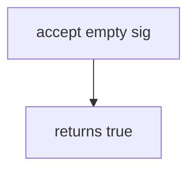

# 7.3-LO-03 — Observe always-true accept, do not trophy a live provider

**Kind:** mechanism-lab
**Loop step:** 3 Break
**Standards:** OWASP ASVS 5.0.0 (final) `v5.0.0-11.2.1`.

## Authorized scope

`labs/7.3/7.3-lab` only. Disposable `lab-secret`. No live Stripe, GitHub, or clinic webhooks.

**Forbidden outcome:** Unsigned webhook body accepted.

## Mental model: path is enough



The vulnerable tree demonstrates **cause** (path trusted). Do not POST anything except this fixture.

## What to read in the fixture

`vulnerable/hook.py` returns true for every triple. Tests require a missing signature to be false.

## Root cause vs impact

| Slice | Lab |
|---|---|
| Root cause | Callback trusted because it hit the path |
| Impact | Forged local event |
| Not the lesson | API10 as the definition |

## Practice

```
python3 -m pytest labs/7.3/7.3-lab/tests --impl vulnerable
```

Record `test_missing_signature_is_rejected`. Do not probe public hosts.

## Transfer

Clinic lab-result webhook. Predict without leaving this directory.

## Non-goals

No live-target instructions. Do not publish provider secrets. `lab-secret` is disposable and local.
