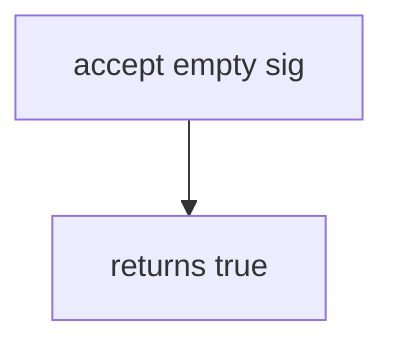

# Practice: an unsigned body is accepted

**Kind:** mechanism-lab
**Loop step:** 3 Break

## Try it

The practice is not a website you attack. It is a tiny Python `accept`. It does not open a network. The failure is already in the function: it returns true for every triple. An unsigned body counting as authentic is a **failed rule**, not a live POST to a live provider.

> An unsigned webhook body is not authentic. `accept("", "body", "lab-secret")` must be false. This practice checks the predicate only. It does not POST a live webhook.

## Where you may practice

Stay inside `labs/7.3/7.3-lab`. The maps are in-process: `accept(sig, body, secret)`. Disposable `lab-secret` and a synthetic `body`. Restore the broken and repaired folders when you are done.

Do not POST to Stripe. Do not POST to GitHub. Do not POST to a clinic webhook. Do not POST to public hosts. Do not paste a live callback URL “to see what happens.”

What must not happen: an unsigned webhook body is accepted. `accept` returns true for an empty signature.

Who could do this: anyone who can POST the callback URL with an empty or wrong signature. That stands in for a forged billing event, an “export-ready” callback, or a clinic lab-result post. What is supposed to stop this: `accept` is **message authenticity over raw bytes**. TLS to the path, a vendor address-range allow-list, and a vendor SDK name are not enough.

## Picture: hitting the path is enough



The broken files show **cause** (the path was trusted). Do not POST anything except this practice. What has to be true first: `accept` returns true for every triple. You do not need HTTP. You must not POST a live provider.

Use a standard-library MAC. Module 5.4 already said TLS proves a hop; this rule is **whether the message came from the provider**. HMAC here is a teaching stand-in, not “we are Stripe.” A famous-bugs nickname for unsafe consumption of APIs is awareness after the cause, not that check.

## What to look at — cause, not a live POST

Open `vulnerable/hook.py`. It returns true for every triple. Tests:

- `test_missing_signature_is_rejected`
- `test_wrong_signature_is_rejected`
- `test_matching_signature_is_accepted` — honest path; may pass on both

You do not need a new secret.

| What you see | What kind of failure | Not the lesson |
|---|---|---|
| `accept` true for empty sig | Path trusted | A live provider POST |
| wrong sig also true | Same always-true hole | A public hunt |
| matching MAC over the same body | Honest path (may pass on both) | Proof that the MAC was checked |

## Why it happens, what it costs, how you stop it, how you notice, how you recover

| Slice | This practice |
|---|---|
| The rule | `accept("", "body", "lab-secret")` is false |
| Why it happens | The callback was trusted because it hit the path |
| What has to be true first | `accept` is always true |
| Trigger | An unauthenticated POST to the callback URL |
| What it costs | Forged local event; in production, forged share, billing, or lab-result |
| How you stop it | MAC over the raw body; fail closed on a missing or wrong sig |
| How you notice | `webhook_sig_fail`; never the body or secret |
| How you recover | Keep deny; rotate the disposable secret if events escaped |
| Not the lesson | A famous-bugs nickname, TLS as authenticity, or a live Stripe POST |

## What the framework does vs what you still have to check

FastAPI will accept a POST with an empty header. nginx TLS termination proves a hop, not a MAC. A vendor address range is shared-fate (NAT, shared cloud egress). Next.js never sees the callback. What this practice is supposed to show: empty sig is false. **Do not POST a live webhook.**

## Practice

```text
python3 -m pytest labs/7.3/7.3-lab/tests --impl vulnerable
```

Run from `labs/7.3/7.3-lab` if a repo-root collection picks up `site/`. Do not probe public hosts. A setup error is not proof the rule holds.

## Use it somewhere new

Clinic lab-result webhook. Predict without leaving this directory. Do not POST a live lab vendor.

## What this page is not doing

No live-target instructions. Do not publish provider secrets. `lab-secret` is disposable and local. Do not dump HMAC cookbooks against public endpoints. Do not “fix” the practice by deleting the test.
