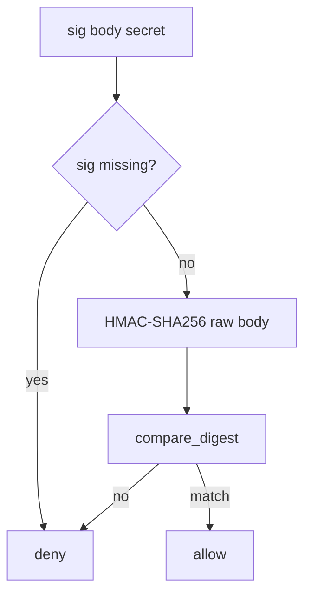

# 7.3-LO-04 — HMAC-SHA256 compare_digest over the raw body

**Kind:** design-exercise
**Loop step:** 4 Build
**Standards:** OWASP ASVS 5.0.0 (final) `v5.0.0-11.2.1`. Replay/freshness (`v5.0.0-2.3.4` / `v5.0.0-2.3.3`) remain residuals. `v5.0.0-4.1.5` is **Level 3, advanced**.

## Structural means the MAC is checked before side effects

`accept` must compute HMAC-SHA256 over the raw body with the disposable secret and compare in constant time. Missing or wrong signatures deny. Structural means that check — not TLS, not an IP list, not a vendor logo, not JWT login of the end user.

The smallest restore for SecureCollab billing webhook is: empty sig denies. Fail-safe: empty signature denies without throwing into a 500 that providers retry (6.7). Do not fail open because the secret store was unreachable.

## Mental model: fail closed on missing sig



The lab’s fixed tree hashes the raw body string with stdlib HMAC-SHA256 and `compare_digest`. Production still needs the MAC **before** `json.loads` (2.1): parse-then-re-serialize is a different document than the provider signed. Replay of a valid MAC (`v5.0.0-2.3.4`) and stale timestamps (`v5.0.0-2.3.3`) are named residuals, not this pytest. Outbound webhook URLs are 6.5, not this inbound MAC.

ASVS `v5.0.0-11.2.1` wants that validated implementation. This pytest is that sentence for empty sig.

## Why this restores the cell

| After the fix | Must be true |
|---|---|
| empty sig | false |
| wrong sig | false |
| matching MAC over same body | true |

## What this is not

TLS as authenticity. IP allow-list. MAC over `json.dumps(json.loads(body))`. JWT of the end user. “We called Stripe.verify” without testing missing sig. Secret in a query string (4.3).

## Mechanism limits

- Correct signature still needs 1.2 on side effects (what the handler writes).
- Replay of a valid MAC (`v5.0.0-2.3.4`) and stale timestamps (`v5.0.0-2.3.3`) remain.
- Outbound webhook URLs are 6.5 (SSRF), not this inbound MAC.
- Provider compromise: least privilege on what a webhook may do.
- Per-message signatures beyond HMAC (`v5.0.0-4.1.5`) are Level 3 advanced.

## Practice

Name the predicate (empty sig denies; HMAC-SHA256 over raw body; `compare_digest`). Run:

```text
python3 -m pytest labs/7.3/7.3-lab/tests --impl fixed
```

Must pass. Run from the lab directory if collection at repo root is polluted.

## Transfer

Clinic: stop treating “the hospital’s IP range” as the lab-result authenticity check.

## Residual risk

Replay; freshness; parse-before-MAC (2.1); 1.2 on writes; 6.5 egress; `v5.0.0-4.1.5` Level 3; secret-in-query (4.3).

## Non-goals

Do not POST a live provider. Do not claim Gate 7 from a TLS screenshot.
